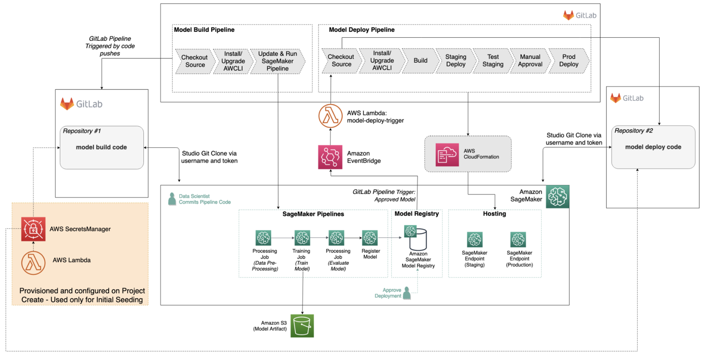

# Demand Stock Forecasting MLOps (Chinese Produce Market RMB)

> **End-to-End AI/ML Platform for Demand & Stock Forecasting in Retail**  
> Automates the full ML lifecycle: data prep, feature engineering, BI dashboard, model training & registry, inference APIs, monitoring, drift detection, and CI/CD – all orchestrated for AWS (Athena, Glue, SageMaker) with robust testing.

---

[](.github/workflows/ci-cd.yml)


[**See full documentation in `docs/`**](docs/)

---

## **Table of Contents**
- [Project Overview](#project-overview)
- [Architecture](#architecture)
- [Quickstart](#quickstart)
- [Project Structure](#project-structure)
- [Data Pipeline & Feature Engineering](#data-pipeline--feature-engineering)
- [Data Infrastructure: Athena, Glue, Feature Store](#data-infrastructure-athena-glue-feature-store)
- [BI Dashboard](#bi-dashboard)
- [Model Training, Registration, and Deployment](#model-training-registration-and-deployment)
- [Model Evaluation & Inference](#model-evaluation--inference)
- [Monitoring & Drift Detection](#monitoring--drift-detection)
- [Testing](#testing)
- [CI/CD & GitHub Workflows](#cicd--github-workflows)
- [Configuration & Environment](#configuration--environment)
- [Extending or Customizing](#extending-or-customizing)
- [References & Acknowledgements](#references--acknowledgements)

---

## Project Overview

This repository delivers a **scalable, production-ready MLOps pipeline** for supermarket demand forecasting, covering the entire machine learning workflow:

- **Data ingestion, validation, feature engineering**
- **Integration with AWS Athena & Glue Data Catalog**
- **Interactive BI dashboard for analytics**
- **Model training, registration, and automated deployment to SageMaker**
- **API endpoints for model inference**
- **Continuous performance monitoring, drift detection, and alerting**
- **Automated testing and CI/CD using GitHub Actions**

See [`docs/`](docs/) for in-depth module explanations.

---

## Architecture



**See specific documentation for deep dives**
- [`docs/data_processing_and_feature_engineering.md`](docs/data_processing_and_feature_engineering.md)
- [`docs/bi_dashboard_readme.md`](docs/bi_dashboard_readme.md) 
- [`docs/model_training_and_registry.md`](docs/model_training_and_registry.md)
- [`docs/model_deployment.md`](docs/model_deployment.md)
- [`docs/api_inference_services.md`](docs/api_inference_services.md)


---

## Quickstart

### 1. **Setup Python Environment**
```bash
# Clone repository
git clone https://github.com/your-org/demand-stock-forecasting-mlops.git
cd demand-stock-forecasting-mlops

# Using conda (recommended)
conda env create -f environment.yml
conda activate demand-forecast-env

# OR pip
pip install -r requirements.txt
````

### 2. **Configure Project**

Edit [`config.yaml`](config.yaml) to match your AWS S3, Athena, Glue, and model parameters.

### 3. **Run Main Pipeline**

```bash
# Use the Makefile to automate tasks (see below for more targets)
make data                # Ingest, validate, feature engineer data
make train               # Train models and register artifacts
make deploy              # Deploy best model to SageMaker endpoint
make dashboard           # Launch BI dashboard locally
make monitor             # Start drift/performance monitoring
make test                # Run full test suite
```

---

## Project Structure

```text
├── src/
│   ├── data_processing/        # Data validation, feature engineering, AWS integration
│   ├── dashboard/              # BI dashboard generation and viewer
│   ├── training/               # Model training logic
│   ├── deployment/             # Model registry, deployment to SageMaker
│   ├── inference/              # Prediction API and utilities
│   ├── monitoring/             # Drift and performance monitoring
│   ├── evaluation/             # Evaluation metrics
│   └── utils/                  # Helpers, data/test generators
├── scripts/                    # CLI/utility scripts for data, endpoints, API test, Athena debug
├── data/
│   ├── raw/                    # Raw CSVs (see Kaggle annex1–4)
│   ├── processed/              # Feature & metadata output
│   ├── monitoring/             # Drift reports, alert logs
│   └── validation/             # Validation summary
├── models/                     # Model and feature info
├── notebooks/                  # EDA & pipeline demo notebooks
├── tests/
│   ├── unit/                   # Unit tests
│   ├── integration/            # Pipeline/E2E/integration tests
│   └── config/, data/          # Test configs, mock data
├── aws-setup/                  # IAM, S3, SageMaker config/policies/scripts
├── docs/                       # Extended docs, images, flowcharts
├── reports/                    # EDA, daily report logs
├── Makefile                    # One-click automation commands
├── config.yaml                 # Project config (S3, Athena, Glue, thresholds, model params)
├── requirements.txt, environment.yml # Dependencies
├── .github/workflows/ci-cd.yml # CI/CD GitHub Actions workflow
└── README.md                   # This file
```

---

## Data Pipeline & Feature Engineering

* **Source:** [`src/data_processing/`](src/data_processing/)

  * [`data_validation.py`](src/data_processing/data_validation.py): Data schema validation, outlier/NA checks.
  * [`feature_engineering.py`](src/data_processing/feature_engineering.py): Rolling features, lags, encoding.
  * [`feature_store_integration.py`](src/data_processing/feature_store_integration.py): Sync with AWS Glue/Athena feature store.
* **Config:** All parameters set in [`config.yaml`](config.yaml)
* **Test data:** [`data/example/`](data/example/), [`tests/data/raw/`](tests/data/raw/)

---

## Data Infrastructure: Athena, Glue, Feature Store

* See [`src/data_processing/feature_store_integration.py`](src/data_processing/feature_store_integration.py) for Athena/Glue setup and queries.
* [`aws-setup/`](aws-setup/) holds scripts for IAM and S3 policy bootstrapping:

  * [`create_sagemaker_policies.sh`](aws-setup/create_sagemaker_policies.sh)
  * [`sagemaker-s3-policy.json`](aws-setup/sagemaker-s3-policy.json)
* Athena schema testing: [`scripts/athena_schema_debug.py`](scripts/athena_schema_debug.py)

---

## BI Dashboard

* **Flow:** Raw/processed data → Local JSON → Dashboard viewer
* **Source:** [`src/dashboard/`](src/dashboard/)

  * [`bi_dashboard_generator.py`](src/dashboard/bi_dashboard_generator.py): Build dashboard data
  * [`dashboard_viewer.py`](src/dashboard/dashboard_viewer.py): Visual/HTML/Streamlit dashboard app
* **Run:**

  ```bash
  make dashboard
  # or
  python scripts/run_dashboard.py
  ```
* See [`docs/bi_dashboard_readme.md`](docs/bi_dashboard_readme.md)

---

## Model Training, Registration, and Deployment

* **Source:** [`src/training/train_model.py`](src/training/train_model.py)
* **Model registry & deployment:** [`src/deployment/`](src/deployment/)

  * [`model_registry.py`](src/deployment/model_registry.py)
  * [`sagemaker_deploy.py`](src/deployment/sagemaker_deploy.py)
  * [`deployment_verification.py`](src/deployment/deployment_verification.py)
* **Automation:** Makefile (`make train`, `make deploy`)
* **SageMaker role setup:** [`sagemaker_iam_setup.py`](sagemaker_iam_setup.py), \[`aws-setup/`]

---

## Model Evaluation & Inference

* **Evaluation:** [`src/evaluation/`](src/evaluation/), [`reports/eda_findings_report.md`](reports/eda_findings_report.md)
* **API inference:** [`src/inference/api.py`](src/inference/api.py), [`src/inference/predictor.py`](src/inference/predictor.py)
* **Test API endpoint:** [`scripts/api_test.py`](scripts/api_test.py)
* **Docs:** [`docs/api_inference_services.md`](docs/api_inference_services.md)

---

## Monitoring & Drift Detection

* **Performance & drift:** [`src/monitoring/`](src/monitoring/)

  * [`performance_monitor.py`](src/monitoring/performance_monitor.py)
  * [`drift_detector.py`](src/monitoring/drift_detector.py)
* **Alert reports:** [`data/monitoring/reports/`](data/monitoring/reports/)
* **Drift state:** [`data/monitoring/state/drift_state.json`](data/monitoring/state/drift_state.json)
* **Launch monitoring:** `make monitor` or [`scripts/monitoring_test.py`](scripts/monitoring_test.py)
* **Docs:** [`docs/perf_monitoring_and_drift_detection.md`](docs/perf_monitoring_and_drift_detection.md)

---

## Testing

* **Run all tests:**

  ```bash
  make test
  # or
  pytest
  ```
* **Unit tests:** [`tests/unit/`](tests/unit/)
* **Integration tests:** [`tests/integration/`](tests/integration/)
* **Test configs/data:** [`tests/config/`](tests/config/), [`tests/data/`](tests/data/)
* **Coverage config:** [`.coveragerc`](.coveragerc)
* **Pre-commit:** [`.pre-commit-config.yaml`](.pre-commit-config.yaml)

---

## CI/CD & GitHub Workflows

* **CI/CD Pipeline:**

  * Automated by [`.github/workflows/ci-cd.yml`](.github/workflows/ci-cd.yml)
  * Steps: lint, test, build, train, register, deploy, monitor, notify
  * Status badges and coverage tracked in [`status_badges.md`](status_badges.md)

* **Setup instructions:** [`git_workflow_setup.sh`](git_workflow_setup.sh)

---

## Configuration & Environment

* **Project configuration:** [`config.yaml`](config.yaml) (edit all S3, Athena, Glue, model params here)
* **Python env:** [`environment.yml`](environment.yml), [`requirements.txt`](requirements.txt)

---

## Extending or Customizing

* Add new data sources, models, or dashboards by extending code in `src/`.
* Update the Makefile for new pipelines.
* Add integration or system tests in `tests/`.

**Steps**
1. Fork the repository
2. Create a feature branch (`git checkout -b feature/AmazingFeature`)
3. Commit your changes (`git commit -m 'Add some AmazingFeature'`)
4. Push to the branch (`git push origin feature/AmazingFeature`)
5. Open a Pull Request

---

## References & Acknowledgements

* [Kaggle Supermarket Sales Dataset](https://www.kaggle.com/datasets/yapwh1208/supermarket-sales-data/data)
* AWS SageMaker, Athena, Glue documentation
* [docs/](docs/) for deep dives

---

**For questions or contributions, open an issue or see [CONTRIBUTING.md](CONTRIBUTING.md) if available.**

For questions and support, please contact btiduwarlambodhar@sandiego.edu or open an issue in the GitHub repository.

