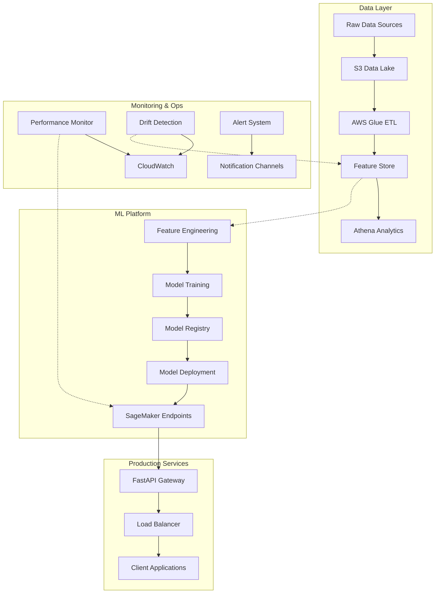

# Demand Stock Forecasting MLOps Platform
## *Production-Ready AI/ML Platform for Chinese Produce Market Forecasting*

> **Enterprise-Grade MLOps Pipeline**: Complete automation of the ML lifecycle from data ingestion to production deployment, featuring AWS SageMaker integration, real-time monitoring, drift detection, and comprehensive CI/CD orchestration.

---

[](.github/workflows/ci-cd.yml)


**Author:** Bhupal Lambodhar | **Email:** btiduwarlambodhar@sandiego.edu  
**AWS Account:** 346761359662 | **Region:** us-east-1

---

## Table of Contents

- [Platform Overview](#platform-overview)
- [System Architecture](#system-architecture)
- [Quick Start](#quick-start)
- [Project Structure](#project-structure)
- [Technology Stack](#technology-stack)
- [Data Pipeline](#data-pipeline)
- [Machine Learning](#machine-learning)
- [Deployment & Infrastructure](#deployment--infrastructure)
- [Monitoring & Observability](#monitoring--observability)
- [Testing Strategy](#testing-strategy)
- [CI/CD Workflows](#cicd-workflows)
- [Detailed Documentation](#detailed-documentation)
- [Security & Compliance](#security--compliance)
- [API Reference](#api-reference)
- [Advanced Configuration](#advanced-configuration)

---

## Platform Overview

This repository delivers a **production-ready, scalable MLOps platform** specifically designed for demand forecasting in Chinese produce markets. The platform handles RMB-denominated transactions and provides end-to-end automation of the machine learning lifecycle.

### Key Capabilities

#### **Data Infrastructure**
- **AWS Athena Integration** - Serverless analytics with SQL queries
- **SageMaker Feature Store** - Centralized feature management
- **AWS Glue Data Catalog** - Automated schema discovery
- **S3 Data Lake** - Scalable data storage and versioning
- **Real-time Data Validation** - Schema validation and quality checks

#### **Machine Learning Platform**
- **Multi-Algorithm Support** - Linear Regression, Random Forest, Gradient Boosting, LSTM, Transformer
- **Automated Hyperparameter Tuning** - Bayesian optimization with SageMaker
- **Model Registry** - Versioned model artifacts with lifecycle management
- **A/B Testing** - Blue-green deployments with traffic splitting
- **Time Series Forecasting** - ARIMA, Prophet, Neural Networks

#### **Production Operations**
- **Real-time API Endpoints** - FastAPI with auto-scaling
- **Performance Monitoring** - System metrics and model performance tracking
- **Drift Detection** - Automated data and model drift detection
- **Alert System** - Email, SMS, and Slack notifications
- **Auto-scaling Infrastructure** - Cost-optimized compute resources

#### **DevOps & Quality**
- **Comprehensive Testing** - Unit, integration, and end-to-end tests
- **Code Quality Gates** - Automated linting, formatting, and security scans
- **CI/CD Pipeline** - GitHub Actions with automated deployments
- **Infrastructure as Code** - Terraform and CloudFormation templates
- **Security Compliance** - IAM policies, encryption, and vulnerability scanning

---

## System Architecture



### Infrastructure Components

| Component | Technology | Purpose |
|-----------|------------|---------|
| **Data Storage** | AWS S3 + Parquet | Scalable data lake with columnar storage |
| **Feature Store** | SageMaker Feature Store | Centralized feature management |
| **Analytics** | AWS Athena + Glue | Serverless data analytics |
| **ML Training** | SageMaker Training Jobs | Managed ML training infrastructure |
| **Model Registry** | SageMaker Model Registry | Model versioning and lifecycle |
| **Inference** | SageMaker Endpoints + FastAPI | Real-time and batch inference |
| **Monitoring** | CloudWatch + Custom Dashboards | System and model monitoring |
| **Orchestration** | AWS Step Functions | Workflow automation |

---

## Quick Start

### Prerequisites

```bash
# Required
- Python 3.10+
- AWS CLI configured
- AWS Account with SageMaker permissions
- 16GB+ RAM (for local training)
```

### 1-Minute Setup

```bash
# 1. Clone and setup environment
git clone https://github.com/btlambodh/demand-stock-forecasting-mlops.git
cd demand-stock-forecasting-mlops

# 2. Quick environment setup
make quick-start                    # Complete setup + first run

# 3. Verify installation
make health-check                   # Check system health
make test-aws-connection           # Verify AWS connectivity
```

### Quick Workflows

```bash
# Development Workflow (Local)
make dev-workflow                   # Data + Training + Testing

# Production Pipeline
make prod-pipeline                  # Full production deployment

# Demo Mode
make demo                          # Interactive demonstration

# Monitoring Dashboard
make monitoring-start              # Start monitoring systems
```

### Verify Setup

```bash
# Check system status
make status                        # Overall system status

# Test core components
make pipeline-data-basic           # Test data pipeline
make train-models                  # Test model training
make api-start                     # Test API service
```

---

## Project Structure

<details>
<summary><b>Click to expand complete project structure</b></summary>

```text
demand-stock-forecasting-mlops/
├── PROJECT CONFIG
│   ├── config.yaml                           # Master configuration (AWS, ML, monitoring)
│   ├── requirements.txt                      # Production dependencies (60+ packages)
│   ├── environment.yml                       # Conda environment specification
│   ├── pytest.ini                           # Testing configuration & markers
│   └── Makefile                              # Automation commands (100+ targets)
│
├── AWS INFRASTRUCTURE
│   └── aws-setup/
│       ├── create_sagemaker_policies.sh      # IAM policy automation
│       ├── sagemaker-s3-policy.json         # S3 access policies
│       ├── sagemaker-trust-policy.json      # Service trust relationships
│       ├── aws_diagnostics.py               # AWS configuration diagnostics
│       └── update_config.py                 # Configuration management
│
├── DATA ECOSYSTEM
│   ├── data/
│   │   ├── raw/                              # Source data (Kaggle supermarket sales)
│   │   │   ├── annex1.csv                    # Item master data
│   │   │   ├── annex2.csv                    # Sales transactions
│   │   │   ├── annex3.csv                    # Wholesale prices
│   │   │   └── annex4.csv                    # Loss rates
│   │   ├── processed/                        # Engineered features & datasets
│   │   │   ├── train.parquet                 # Training dataset
│   │   │   ├── validation.parquet            # Validation dataset
│   │   │   ├── test.parquet                  # Test dataset
│   │   │   ├── features.parquet              # Complete feature set
│   │   │   ├── feature_metadata.json         # Feature engineering metadata
│   │   │   └── feature_store_metadata.json   # Feature store integration data
│   │   ├── example/                          # Demo data & test scenarios
│   │   │   ├── basic_test.json               # Basic API test cases
│   │   │   ├── batch_test.json               # Batch inference tests
│   │   │   └── ... (other test scenarios)
│   │   ├── monitoring/                       # Monitoring data & reports
│   │   │   ├── reports/                      # Automated reports
│   │   │   │   ├── alert_data_drift_*.json   # Drift detection alerts
│   │   │   │   └── drift_report_*.html       # Detailed drift analysis
│   │   │   └── state/                        # Monitoring state persistence
│   │   │       └── drift_state.json          # Current drift detection state
│   │   └── validation/                       # Data quality reports
│   │       └── validation_summary.json       # Data validation results
│
├── MACHINE LEARNING CORE
│   ├── src/
│   │   ├── data_processing/                  # Data pipeline components
│   │   │   ├── data_validation.py            # Schema validation & quality checks
│   │   │   ├── feature_engineering.py        # Feature creation & transformation
│   │   │   └── feature_store_integration.py  # AWS Feature Store integration
│   │   ├── training/                         # ML training orchestration
│   │   │   └── train_model.py                # Multi-algorithm training pipeline
│   │   ├── deployment/                       # Model deployment & registry
│   │   │   ├── model_registry.py             # Model versioning & lifecycle
│   │   │   ├── sagemaker_deploy.py           # SageMaker deployment automation
│   │   │   └── deployment_verification.py    # Deployment testing & validation
│   │   ├── inference/                        # Prediction services
│   │   │   ├── api.py                        # FastAPI REST endpoints
│   │   │   └── predictor.py                  # Prediction logic & utilities
│   │   ├── monitoring/                       # Observability & alerting
│   │   │   ├── performance_monitor.py        # System performance tracking
│   │   │   └── drift_detector.py             # Data & model drift detection
│   │   ├── dashboard/                        # Business intelligence
│   │   │   ├── bi_dashboard_generator.py     # Dashboard data generation
│   │   │   └── dashboard_viewer.py           # Interactive dashboard interface
│   │   ├── evaluation/                       # Model evaluation & metrics
│   │   └── utils/                            # Shared utilities
│   │       └── test_data_generator.py        # Test data generation
│
├── MODELS & ARTIFACTS
│   ├── models/
│   │   ├── evaluation.json                   # Model performance metrics
│   │   ├── feature_info.json                # Feature importance & metadata
│   │   └── best_model.pkl                   # Production model artifact
│
├── COMPREHENSIVE TESTING
│   ├── tests/
│   │   ├── unit/                            # Fast unit tests
│   │   │   ├── test_data_processing.py      # Data pipeline tests
│   │   │   ├── test_model_training.py       # ML training tests
│   │   │   ├── test_deployment.py           # Deployment tests
│   │   │   └── test_monitoring.py           # Monitoring tests
│   │   ├── integration/                     # Integration tests
│   │   │   ├── test_data_pipeline.py        # End-to-end data flow
│   │   │   ├── test_training_pipeline.py    # Training workflow tests
│   │   │   ├── test_deployment_pipeline.py  # Deployment workflow tests
│   │   │   └── test_end_to_end.py          # Complete system tests
│   │   ├── config/                          # Test configurations
│   │   │   └── test_config.yaml            # Test environment settings
│   │   └── data/                           # Test datasets & fixtures
│       └── conftest.py                      # Pytest configuration & fixtures
│
├── DOCUMENTATION & GUIDES
│   ├── docs/
│   │   ├── api_inference_services.md        # API documentation
│   │   ├── bi_dashboard_readme.md          # Dashboard setup guide
│   │   ├── data_processing_and_feature_engineering.md  # Data pipeline guide
│   │   ├── model_training_and_registry.md   # ML training documentation
│   │   ├── model_deployment.md             # Deployment guide
│   │   ├── perf_monitoring_and_drift_detection.md  # Monitoring guide
│   │   ├── how_to_set_up_env.md           # Environment setup
│   │   └── images/                        # Architecture diagrams & screenshots
│   │       ├── MLOps_Architecture.png      # System architecture diagram
│   │       ├── data_processing_flow.png    # Data pipeline visualization
│   │       ├── model_deployment_flow.png   # Deployment workflow
│   │       └── monitoring_dashboard.png    # Monitoring interface
│
├── REPORTS & ANALYTICS
│   ├── reports/
│   │   ├── eda_findings_report.md          # Exploratory data analysis
│   │   └── daily_report_*.txt             # Operational reports
│
├── AUTOMATION SCRIPTS
│   ├── scripts/
│   │   ├── api_test.py                     # API endpoint testing
│   │   ├── api_diagnostic.py               # API troubleshooting
│   │   ├── athena_schema_debug.py          # Athena debugging
│   │   ├── monitoring_test.py              # Monitoring system tests
│   │   ├── run_dashboard.py                # Dashboard launcher
│   │   └── setup_test_env.py              # Test environment setup
│
├── INTERACTIVE NOTEBOOKS
│   ├── notebooks/
│   │   ├── eda_notebook.ipynb              # Exploratory data analysis
│   │   └── mlops_pipeline_notebook.ipynb   # Complete pipeline demo
│
├── CI/CD & WORKFLOWS
│   ├── .github/
│   │   ├── workflows/
│   │   │   └── ci-cd.yml                   # GitHub Actions pipeline
│   │   ├── ISSUE_TEMPLATE/                 # Issue templates
│   │   │   ├── bug_report.md              # Bug report template
│   │   │   └── feature_request.md         # Feature request template
│   │   └── pull_request_template.md        # PR template
│
├── PROJECT CONFIGURATION
│   ├── .gitignore                          # Git ignore rules
│   ├── .pre-commit-config.yaml            # Pre-commit hooks
│   ├── .coveragerc                        # Code coverage configuration
│   ├── setup_project.py                   # Project initialization
│   ├── sagemaker_iam_setup.py             # SageMaker IAM automation
│   ├── role_checker.py                    # AWS role verification
│   └── git_workflow_setup.sh              # Git workflow configuration
│
└── PROJECT METADATA
    ├── status_badges.md                    # CI/CD status tracking
    └── README.md                          # This comprehensive guide
```

</details>

---

## Technology Stack

### **Machine Learning & AI**
```yaml
Core ML:           scikit-learn, pandas, numpy
Deep Learning:     TensorFlow, Keras, PyTorch
Time Series:       Prophet, ARIMA, statsmodels
Optimization:      Optuna, Hyperopt, Ray Tune
Interpretability:  SHAP, LIME, ELI5
```

### **AWS Cloud Infrastructure**
```yaml
ML Platform:       SageMaker (Training, Endpoints, Feature Store)
Analytics:         Athena, Glue Data Catalog
Storage:           S3, CloudWatch
Orchestration:     Step Functions, Lambda
Security:          IAM, KMS, VPC
```

### **API & Web Services**
```yaml
API Framework:     FastAPI, Uvicorn
Dashboards:        Streamlit, Dash, Plotly
HTTP Client:       Requests, HTTPX
Async:             AsyncIO, HTTPX
```

### **Testing & Quality**
```yaml
Testing:           Pytest, Moto (AWS mocking)
Coverage:          pytest-cov, coverage.py
Code Quality:      Black, Flake8, isort, MyPy
Security:          Bandit, Safety
```

### **Data Processing**
```yaml
Data Formats:      Parquet, JSON, CSV
Processing:        Dask, NumPy, Pandas
Validation:        Pydantic, Great Expectations
Storage:           PyArrow, FastParquet
```

### **DevOps & Infrastructure**
```yaml
Containerization:  Docker
CI/CD:             GitHub Actions
Configuration:     YAML, Python-dotenv
Monitoring:        Prometheus, Grafana, MLflow
```

---

## Data Pipeline

### **Data Architecture**

Our data pipeline implements a **modern data lake architecture** with the following layers:

#### **1. Raw Data Ingestion**
```bash
# Source: Kaggle Supermarket Sales Dataset
make validate-data              # Schema validation & quality checks
make process-features          # Feature engineering pipeline
```

**Data Sources:**
- `annex1.csv` - **Item Master Data**: Product catalogs, categories, pricing
- `annex2.csv` - **Sales Transactions**: Daily sales records with quantities
- `annex3.csv` - **Wholesale Prices**: Market price fluctuations
- `annex4.csv` - **Loss Rates**: Spoilage and inventory loss data

#### **2. Feature Engineering Pipeline**
```python
# Automated feature generation
Temporal Features:    lag_features=[1,7,14,30], seasonality=weekly/monthly
Price Features:       moving_averages=[7,14,30], volatility_windows
External Features:    holidays=True, exchange_rate=True
```

#### **3. AWS Feature Store Integration**
```bash
# Setup complete data infrastructure
make setup-data-infrastructure     # Feature Store + Athena + Glue
make verify-athena                # Test analytics queries
```

**Feature Store Benefits:**
- **Centralized Features** - Single source of truth
- **Online/Offline Access** - Real-time and batch features
- **Automatic Versioning** - Feature lineage tracking
- **Time Travel** - Historical feature values

#### **4. Analytics & BI**
```bash
# Business Intelligence Pipeline
make pipeline-bi                  # Complete BI setup with verification
make run-sample-queries          # Execute business analytics
```

**Athena Query Examples:**
```sql
-- Daily sales trends
SELECT date, SUM(quantity * price) as daily_revenue 
FROM features_complete 
WHERE date >= '2024-01-01' 
GROUP BY date ORDER BY date;

-- Top performing products
SELECT item_code, AVG(quantity) as avg_sales
FROM features_complete 
GROUP BY item_code 
ORDER BY avg_sales DESC LIMIT 10;
```

### **Data Validation Rules**

```yaml
# From config.yaml
validation:
  date_range: ['2020-01-01', '2024-12-31']
  min_data_points: 100
  max_missing_percentage: 0.1
  quality_thresholds:
    completeness: 95%
    accuracy: 98%
    consistency: 90%
```

---

## Machine Learning

### **Model Portfolio**

Our platform supports **multiple algorithm families** for robust forecasting:

#### **Classical ML Models**
```python
# Statistical & Tree-based Models
algorithms = [
    "linear_regression",     # Baseline linear model
    "ridge",                # L2 regularized regression  
    "random_forest",        # Ensemble tree method
    "gradient_boosting"     # XGBoost-style boosting
]
```

#### **Time Series Specialists**
```python
# Statistical Time Series
models = {
    "arima": {
        "seasonal": True,
        "max_p": 5, "max_q": 5, "max_d": 2
    },
    "prophet": {
        "seasonality_mode": "additive",
        "weekly_seasonality": True,
        "yearly_seasonality": True
    }
}
```

#### **Deep Learning Models**
```python
# Neural Network Architectures
neural_networks = {
    "lstm": {"hidden_units": [64, 32], "dropout": 0.2},
    "gru": {"hidden_units": [64, 32], "dropout": 0.2}, 
    "transformer": {"d_model": 64, "n_heads": 8, "num_layers": 4}
}
```

### **Training Configuration**

#### **Data Splitting Strategy**
```yaml
# Time-aware splitting for forecasting
training:
  train_ratio: 0.7          # 70% for training
  validation_ratio: 0.15    # 15% for validation  
  test_ratio: 0.15          # 15% for final testing
  
  cross_validation:
    method: time_series_split  # Respects temporal order
    n_splits: 5
    test_size: 30             # Days for each test fold
```

#### **Hyperparameter Optimization**
```yaml
# Automated tuning with Bayesian optimization
hyperparameter_tuning:
  method: bayesian
  objective_metric: validation:mape
  max_jobs: 20
  max_parallel_jobs: 4
```

### **Evaluation Framework**

#### **Performance Metrics**
```python
# Comprehensive evaluation metrics
metrics = [
    "mae",      # Mean Absolute Error
    "mse",      # Mean Squared Error  
    "rmse",     # Root Mean Squared Error
    "mape",     # Mean Absolute Percentage Error
    "smape",    # Symmetric MAPE
    "r2"        # R-squared coefficient
]

# Performance thresholds
thresholds = {
    "mape_max": 15.0,     # Max 15% error
    "rmse_max": 5.0,      # Max RMSE of 5
    "r2_min": 0.7         # Min R² of 70%
}
```

#### **Forecast Horizons**
```python
# Multi-horizon evaluation
forecast_horizons = [1, 7, 14, 30]  # 1 day to 1 month ahead
```

### **Training Workflows**

```bash
# Basic Training Pipeline
make train-models              # Train all configured models
make register-models          # Register to SageMaker Model Registry

# Complete ML Pipeline  
make pipeline-train-full      # Data + Training + Registry

# Model Management
make list-models              # View all registered models
make promote-model            # Promote dev -> staging -> prod
```

### **Model Registry & Lifecycle**

```python
# Model stages and promotion
stages = ["dev", "staging", "prod"]

# Automated model promotion criteria
promotion_criteria = {
    "performance_improvement": 0.05,  # 5% better performance
    "stability_threshold": 0.95,     # 95% prediction stability
    "drift_tolerance": 0.25          # Max 25% feature drift
}
```

---

## Deployment & Infrastructure

### **Multi-Environment Strategy**

Our deployment strategy supports **three distinct environments** with different configurations:

#### **Development Environment**
```yaml
dev:
  instance_type: ml.t2.medium
  initial_instance_count: 1
  auto_scaling_enabled: false
  purpose: "Feature development and testing"
```

#### **Staging Environment**  
```yaml
staging:
  instance_type: ml.m5.large
  initial_instance_count: 1
  auto_scaling_enabled: true
  min_capacity: 1
  max_capacity: 3
  purpose: "Pre-production validation"
```

#### **Production Environment**
```yaml
prod:
  instance_type: ml.m5.xlarge
  initial_instance_count: 2
  auto_scaling_enabled: true
  min_capacity: 2
  max_capacity: 10
  purpose: "Live production workloads"
```

### **Blue-Green Deployment**

```yaml
# Zero-downtime deployment strategy
blue_green:
  enabled: true
  traffic_shift_percentage: 10     # Gradual traffic shift
  evaluation_period: 300          # 5-minute evaluation
  auto_rollback_enabled: true
  performance_threshold: 0.2      # 20% degradation triggers rollback
```

### **Deployment Commands**

```bash
# Environment-specific deployments
make deploy-dev                # Deploy to development
make deploy-staging           # Deploy to staging  
make deploy-prod             # Deploy to production

# Deployment management
make list-endpoints          # List all active endpoints
make test-endpoint          # Test endpoint functionality
make delete-endpoint        # Clean up endpoints
```

### **Infrastructure Monitoring**

```bash
# Real-time infrastructure monitoring
make monitoring-start       # Start all monitoring systems
make monitoring-status     # Check system health
make monitoring-logs       # View monitoring logs
```

**Monitored Metrics:**
-  **CPU Usage**: Target <80%
-  **Memory Usage**: Target <85%  
-  **Disk Usage**: Target <90%
-  **API Response Time**: Target <100ms
-  **Prediction Latency**: Target <50ms
-  **Throughput**: Requests per second
-  **Error Rate**: Target <1%

### **Auto-scaling Configuration**

```yaml
# Intelligent auto-scaling
auto_scaling:
  metrics: ["CPUUtilization", "MemoryUtilization", "RequestCount"]
  target_cpu: 70.0
  target_memory: 80.0
  scale_up_cooldown: 300     # 5 minutes
  scale_down_cooldown: 600   # 10 minutes
```

### **Cost Optimization**

```yaml
# Cost-aware infrastructure
cost_optimization:
  spot_instances:
    enabled: false            # Disable for production stability
    max_price: '0.50'
  
  scheduled_scaling:
    enabled: true
    timezone: Asia/Shanghai
    scale_up_cron: "0 8 * * *"    # Scale up at 8 AM
    scale_down_cron: "0 18 * * *"  # Scale down at 6 PM
```

---

## Monitoring & Observability

### **Comprehensive Monitoring Stack**

Our monitoring system provides **360-degree observability** across all system components:

#### **Performance Monitoring**
```bash
# Start comprehensive monitoring
make monitoring-start           # All monitoring systems
make monitoring-dashboard-only  # Dashboard only
make monitoring-performance-only # Performance metrics only
```

**System Health Metrics:**
- **Infrastructure**: CPU, Memory, Disk, Network
- **Model Performance**: Accuracy, Latency, Throughput  
- **Data Quality**: Completeness, Freshness, Schema validation
- **API Health**: Response times, Error rates, Availability

#### **Data & Model Drift Detection**

```yaml
# Drift detection configuration
monitoring:
  performance:
    drift_threshold: 0.25              # 25% drift triggers alert
    monitoring_window: 7               # Days to monitor
    performance_degradation_threshold: 0.15  # 15% degradation limit
  
  data_quality:
    missing_data_threshold: 0.05       # 5% missing data limit
    outlier_threshold: 3.0            # 3-sigma outlier detection
```

```bash
# Drift detection workflows
make detect-drift             # One-time drift analysis
make monitoring-drift-only    # Continuous drift monitoring
```

**Drift Detection Methods:**
-  **Population Stability Index (PSI)** - Distribution changes
-  **Kolmogorov-Smirnov Test** - Statistical distribution drift
-  **Model Performance Drift** - Accuracy degradation over time
-  **Schema Drift** - Data structure changes

#### ** Alert System**

```yaml
# Multi-channel alerting
alerts:
  enabled: true
  local_mode: true
  cooldown_minutes: 30
  channels:
    email: btiduwarlambodhar@sandiego.edu
    sns_topic: arn:aws:sns:us-east-1:346761359662:demand-stock-forecast-alerts
    slack_webhook: null  # Configure for Slack notifications
```

**Alert Types:**
-  **Critical**: System failures, severe performance degradation
-  **Warning**: Moderate drift, performance issues
-  **Info**: Successful deployments, routine updates

###  **Real-time Dashboards**

```bash
# Interactive monitoring dashboards
make monitoring-start         # Launches dashboard on available port
# Dashboard accessible at: http://localhost:8050 (or next available port)
```

**Dashboard Features:**
-  **Real-time Metrics**: Live system performance
-  **Model Performance Trends**: Accuracy over time
-  **Data Quality Monitoring**: Freshness and completeness
-  **Alert History**: Recent alerts and resolution status
-  **System Health**: Overall platform status

###  **Monitoring Commands**

```bash
# Monitoring lifecycle
make monitoring-start         # Start all monitoring systems
make monitoring-status        # Check detailed system status
make monitoring-stop          # Stop all monitoring processes
make monitoring-restart       # Restart monitoring systems

# Troubleshooting
make monitoring-debug         # Debug monitoring issues
make monitoring-logs          # View monitoring logs
make monitoring-clean         # Clean temporary files

# Testing
make monitoring-test          # Test monitoring components
make performance-report       # Generate performance report
```

###  **Monitoring Reports**

**Automated Reports Generated:**
-  **Daily Reports**: `reports/daily_report_*.txt`
-  **Drift Alerts**: `data/monitoring/reports/alert_data_drift_*.json`
-  **Drift Analysis**: `data/monitoring/reports/drift_report_*.html`
-  **Performance Metrics**: Real-time CloudWatch integration

###  **Emergency Procedures**

```bash
# Emergency operations
make emergency-stop           # Stop all services immediately
make monitoring-clean         # Clean monitoring state
make system-restart          # Emergency system restart
```

---

## Testing Strategy

### **Comprehensive Testing Framework**

Our testing strategy implements **multi-layered quality assurance** with 90%+ code coverage:

#### **Test Categories & Markers**

```python
# Test markers for organized execution
markers = {
    # Test Categories
    "unit": "Fast, isolated component tests",
    "integration": "Component interaction tests", 
    "e2e": "End-to-end workflow tests",
    
    # Component-Specific
    "data": "Data processing and validation tests",
    "training": "Model training and evaluation tests",
    "deployment": "Deployment and infrastructure tests",
    "monitoring": "Monitoring and observability tests",
    "api": "API endpoint and service tests",
    
    # Infrastructure
    "aws": "AWS services integration tests",
    "sagemaker": "SageMaker functionality tests",
    "s3": "S3 storage and pipeline tests",
    
    # Performance
    "slow": "Tests taking >30 seconds",
    "fast": "Tests completing <5 seconds",
    "performance": "Load and performance tests"
}
```

#### **Test Execution Commands**

```bash
# Quick Testing
make test-fast                # Fast tests only (<5 seconds)
make test-unit               # Unit tests only
make test-integration        # Integration tests only

# Comprehensive Testing  
make test                    # All tests (unit + integration)
make test-coverage          # Tests with coverage analysis
make test-full              # Complete testing pipeline (format + lint + security + coverage)

# Targeted Testing
pytest -m "unit and not slow"              # Fast unit tests
pytest -m "integration and data"           # Data integration tests
pytest -m "api or deployment"              # API and deployment tests
pytest tests/unit/ -m "fast"               # Fast unit tests only
```

#### ** Coverage Configuration**

```yaml
# Coverage requirements
coverage:
  minimum_coverage: 70%
  target_coverage: 90%
  
  exclude_patterns:
    - "*/tests/*"
    - "*/__pycache__/*"  
    - "*/venv/*"
    - "setup.py"
    
  report_formats:
    - html: "reports/htmlcov"
    - xml: "reports/coverage.xml"
    - json: "reports/coverage.json"
    - terminal: "term-missing"
```

#### ** Test Structure**

```text
tests/
├── unit/                        # Fast, isolated tests
│   ├── test_data_processing.py  # Data pipeline unit tests
│   ├── test_model_training.py   # ML training unit tests  
│   ├── test_deployment.py       # Deployment unit tests
│   └── test_monitoring.py       # Monitoring unit tests
├── integration/                 # Component interaction tests
│   ├── test_data_pipeline.py    # End-to-end data flow
│   ├── test_training_pipeline.py # Training workflow tests
│   ├── test_deployment_pipeline.py # Deployment workflow tests
│   └── test_end_to_end.py       # Complete system tests
├── config/                      # Test configurations
│   └── test_config.yaml         # Test environment settings
├── data/                        # Test datasets & fixtures
│   ├── processed/               # Test processed data
│   └── raw/                     # Test raw data
└── conftest.py                  # Pytest configuration & fixtures
```

###  **Quality Gates**

#### **Code Quality**
```bash
# Code formatting and style
make format                  # Black + isort formatting
make lint                   # Flake8 + MyPy linting
make quality-check          # Complete quality pipeline
```

#### **Security Testing**
```bash
# Security and vulnerability scanning
make security-check         # Bandit + Safety scans
```

**Security Checks Include:**
-  **Bandit**: Python security vulnerability scanner
-  **Safety**: Dependency vulnerability checker  
-  **Secrets**: No hardcoded secrets or credentials
-  **Code Quality**: Adherence to security best practices

#### **Performance Testing**
```yaml
# Load testing configuration
load_testing:
  duration_minutes: 10
  max_requests_per_second: 100
  
# Timeout configuration
timeout: 300                # 5-minute global timeout
timeout_method: thread      # Thread-based timeouts
```

###  **CI-Friendly Testing**

```bash
# CI/CD optimized test execution
pytest -m "not slow" --maxfail=1 --tb=line       # Quick CI tests
pytest -m "unit" --cov-fail-under=80             # Unit tests with coverage
pytest -m "integration and not aws"              # Integration without AWS
```

###  **Test Reporting**

```yaml
# JUnit XML for CI/CD integration
junit_suite_name: MLOps_Test_Suite
junit_logging: all
junit_log_passing_tests: true
junit_duration_report: total
```

**Generated Reports:**
-  **HTML Coverage**: `reports/htmlcov/index.html`
-  **XML Coverage**: `reports/coverage.xml`  
-  **JUnit XML**: `reports/junit.xml`
-  **Security Report**: `security_report.json`

---

## CI/CD Workflows

### **Automated Pipeline**

Our CI/CD pipeline provides **comprehensive automation** from code commit to production deployment:

#### **GitHub Actions Workflow**

```yaml
# .github/workflows/ci-cd.yml
name: MLOps CI/CD Pipeline
on: [push, pull_request]

jobs:
  test:
    runs-on: ubuntu-latest
    steps:
      - name:  Run Tests
      - name:  Code Quality  
      - name:  Security Scan
      - name:  Coverage Report
      
  build:
    needs: test
    steps:
      - name:  Build Artifacts
      - name:  Package Models
      
  deploy:
    needs: build
    steps:
      - name:  Deploy to Staging
      - name:  Verify Deployment
      - name:  Start Monitoring
```

#### **CI/CD Simulation Commands**

```bash
# Local CI/CD testing
make ci-full                 # Complete CI/CD simulation
make ci-install             # Simulate CI dependency installation
make ci-test               # Simulate CI testing phase  
make ci-quality            # Simulate CI quality gates
```

#### **Pipeline Status**

[](.github/workflows/ci-cd.yml)

**Pipeline Stages:**
1. **Code Quality** - Linting, formatting, security scans
2. **Testing** - Unit, integration, and e2e tests
3. **Build** - Model artifacts and package creation
4. **Deploy** - Automated deployment to staging/production
5. **Monitor** - Post-deployment monitoring and validation

### **Environment Promotion**

```bash
# Automated model promotion workflow
make promote-model SOURCE_STAGE=dev TARGET_STAGE=staging
make promote-model SOURCE_STAGE=staging TARGET_STAGE=prod
```

**Promotion Criteria:**
- **Performance Improvement**: >5% better metrics
- **Stability**: >95% prediction consistency
- **Security**: Passed security scans
- **Quality**: >90% test coverage

### **Quality Gates**

```yaml
# Automated quality requirements
quality_gates:
  test_coverage: 70%          # Minimum test coverage
  security_score: A           # Security grade requirement  
  performance_regression: 5%   # Max performance degradation
  code_complexity: 10         # Cyclomatic complexity limit
```

---

## Detailed Documentation

### **Comprehensive Guides**

Our documentation provides **in-depth guidance** for all aspects of the platform:

#### **Core Documentation**
- [`data_processing_and_feature_engineering.md`](docs/data_processing_and_feature_engineering.md) - Complete data pipeline guide
- [`model_training_and_registry.md`](docs/model_training_and_registry.md) - ML training and model management
- [`model_deployment.md`](docs/model_deployment.md) - Deployment strategies and best practices
- [`api_inference_services.md`](docs/api_inference_services.md) - API development and usage
- [`perf_monitoring_and_drift_detection.md`](docs/perf_monitoring_and_drift_detection.md) - Monitoring and observability
- [`bi_dashboard_readme.md`](docs/bi_dashboard_readme.md) - Business intelligence and analytics

#### **Setup & Configuration**
- [`how_to_set_up_env.md`](docs/how_to_set_up_env.md) - Environment setup guide
- **Configuration Reference** - Complete `config.yaml` documentation
- **AWS Setup Guide** - IAM policies and infrastructure setup

#### **Visual Documentation**
- **Architecture Diagrams** - System design and data flow
- **Dashboard Screenshots** - Monitoring interface examples  
- **Workflow Diagrams** - Process flow visualizations
- **Performance Charts** - Benchmark and performance data

### **Interactive Examples**

#### **Jupyter Notebooks**
- [`eda_notebook.ipynb`](notebooks/eda_notebook.ipynb) - Exploratory data analysis
- [`mlops_pipeline_notebook.ipynb`](notebooks/mlops_pipeline_notebook.ipynb) - Complete pipeline demonstration

#### **Quick Start Examples**

```bash
# Interactive demo mode
make demo                    # Guided demonstration of all features

# Component demonstrations  
make pipeline-bi            # Business intelligence demo
make workflow-dev           # Development workflow demo
make monitoring-start       # Monitoring dashboard demo
```

### **API Documentation**

#### **Interactive API Docs**
```bash
# Start API with automatic documentation
make api-start              # API available at http://localhost:8000
# Swagger UI: http://localhost:8000/docs
# ReDoc: http://localhost:8000/redoc
```

#### **API Testing Examples**
```bash
# Comprehensive API testing
make api-test               # Test all endpoints
make api-health            # Check API health status
```

---

## Security & Compliance

### **Security Framework**

Our platform implements **enterprise-grade security** throughout the entire ML lifecycle:

#### **AWS Security Configuration**

```yaml
# IAM and Access Control
security:
  encryption:
    s3_encryption: AES256
    kms_key_id: null
    
  iam_policies:
    sagemaker_execution_role: "arn:aws:iam::346761359662:role/service-role/AmazonSageMaker-ExecutionRole"
    principle_of_least_privilege: true
    
  vpc_configuration:
    enabled: false              # Can be enabled for enhanced isolation
    vpc_id: null
    subnet_ids: []
    security_group_ids: []
```

#### **Security Scanning**

```bash
# Automated security checks
make security-check         # Complete security scan
```

**Security Checks Include:**
- **Dependency Vulnerabilities** - Safety scanner for known CVEs
- **Code Security Issues** - Bandit static analysis
- **Secrets Detection** - No hardcoded credentials
- **Compliance Validation** - Security best practices

#### **Data Protection**

**Data Security Measures:**
- **Encryption at Rest** - S3 AES256 encryption
- **Encryption in Transit** - HTTPS/TLS for all communications
- **Data Anonymization** - PII removal and masking
- **Access Logging** - CloudTrail for audit trails
- **Data Lineage** - Complete data provenance tracking

#### **Model Security**

**Model Protection:**
- **Model Signing** - Cryptographic model integrity
- **Secure Model Registry** - Access-controlled artifact storage
- **Inference Security** - API authentication and rate limiting
- **Audit Logging** - Model access and prediction logging

### **Compliance Features**

#### **Regulatory Compliance**
- **GDPR Compliance** - Data privacy and deletion rights
- **SOX Compliance** - Financial data controls (for RMB transactions)
- **ISO 27001** - Information security management
- **Cloud Security** - AWS Well-Architected Framework

#### **Audit & Governance**
```yaml
# Compliance monitoring
compliance:
  audit_logging: true
  data_retention_days: 2555  # 7 years for financial data
  access_reviews: quarterly
  security_assessments: monthly
```

---

## API Reference

### **RESTful API Endpoints**

Our FastAPI service provides **comprehensive REST endpoints** for all ML operations:

#### **Quick API Start**

```bash
# Start local API service
make api-start              # Production mode
make api-dev               # Development mode with auto-reload

# API available at: http://localhost:8000
# Swagger Documentation: http://localhost:8000/docs
# ReDoc Documentation: http://localhost:8000/redoc
```

#### **Core Endpoints**

##### **Health & Status**
```http
GET /health                 # API health check
GET /status                 # Detailed system status
GET /metrics               # Performance metrics
```

##### **Predictions**
```http
POST /predict              # Single prediction
POST /predict/batch        # Batch predictions
GET /predict/status/{id}   # Prediction job status
```

##### **Model Management**
```http
GET /models                # List available models
GET /models/{id}           # Model details
POST /models/deploy        # Deploy model version
DELETE /models/{id}        # Remove model
```

##### **Data Operations**
```http
POST /data/validate        # Validate input data
GET /data/features         # Available features
POST /data/drift           # Drift detection
```

#### **API Usage Examples**

##### **Single Prediction**
```python
import requests

# Prediction request
data = {
    "item_code": "PROD001",
    "date": "2024-06-24",
    "historical_sales": [10, 15, 12, 18, 20],
    "price": 25.50,
    "season": "summer"
}

response = requests.post(
    "http://localhost:8000/predict",
    json=data
)

prediction = response.json()
# {"forecast": 22.3, "confidence": 0.85, "horizon": "1_day"}
```

##### **Batch Predictions**
```python
# Batch prediction request
batch_data = {
    "items": [
        {"item_code": "PROD001", "date": "2024-06-24", ...},
        {"item_code": "PROD002", "date": "2024-06-24", ...},
        # ... more items
    ],
    "forecast_horizon": 7
}

response = requests.post(
    "http://localhost:8000/predict/batch",
    json=batch_data
)

results = response.json()
# {"job_id": "abc123", "status": "processing", "estimated_completion": "2024-06-24T10:05:00Z"}
```

#### **API Testing**

```bash
# Comprehensive API testing
make api-test              # Test all endpoints
make api-health           # Quick health check

# Manual testing with curl
curl -X GET http://localhost:8000/health
curl -X POST http://localhost:8000/predict \
  -H "Content-Type: application/json" \
  -d '{"item_code": "PROD001", "date": "2024-06-24", "price": 25.50}'
```

#### **Authentication & Security**

```python
# API Security Configuration
security_config = {
    "rate_limiting": "100 requests/minute",
    "authentication": "API key based",
    "input_validation": "Pydantic schemas",
    "output_sanitization": "Automatic",
    "logging": "Request/response logging"
}
```

#### **Response Formats**

##### **Successful Prediction Response**
```json
{
    "forecast": 22.3,
    "confidence": 0.85,
    "forecast_horizon": "1_day",
    "model_version": "v20240624_152030",
    "features_used": ["price", "seasonality", "lag_7"],
    "timestamp": "2024-06-24T15:30:24Z",
    "metadata": {
        "processing_time_ms": 45,
        "model_name": "chinese_produce_forecaster",
        "data_quality_score": 0.98
    }
}
```

##### **Error Response**
```json
{
    "error": "ValidationError",
    "message": "Invalid date format",
    "details": {
        "field": "date",
        "expected_format": "YYYY-MM-DD",
        "received": "24-06-2024"
    },
    "timestamp": "2024-06-24T15:30:24Z",
    "request_id": "req_abc123"
}
```

---

## Advanced Configuration

### **Master Configuration File**

The `config.yaml` file serves as the **single source of truth** for all platform settings:

#### **Infrastructure Configuration**

```yaml
# AWS Infrastructure Setup
aws:
  account_id: '346761359662'
  region: us-east-1
  
  sagemaker:
    execution_role: "arn:aws:iam::346761359662:role/service-role/AmazonSageMaker-ExecutionRole"
    
    # Training Infrastructure
    instance_type_training: ml.m5.xlarge
    max_runtime_seconds: 86400  # 24 hours
    
    # Inference Infrastructure  
    endpoint_config:
      initial_instance_count: 1
      instance_type: ml.t2.medium
      auto_scaling:
        min_capacity: 1
        max_capacity: 10
        target_value: 70.0
```

#### **Model Configuration**

```yaml
# ML Model Settings
models:
  default_model: random_forest
  model_types: [linear_regression, ridge, random_forest, gradient_boosting]
  
  # Performance Thresholds
  performance_thresholds:
    mape_max: 15.0      # Maximum 15% error
    rmse_max: 5.0       # Maximum RMSE of 5
    r2_min: 0.7         # Minimum R² of 70%
    
  # Hyperparameter Tuning
  hyperparameter_tuning:
    method: bayesian
    objective_metric: validation:mape
    max_jobs: 20
    max_parallel_jobs: 4
```

#### **Monitoring Configuration**

```yaml
# Monitoring & Alerting
monitoring:
  performance:
    drift_threshold: 0.25
    monitoring_window: 7
    cpu_threshold: 80
    memory_threshold: 85
    
  alerts:
    enabled: true
    cooldown_minutes: 30
    email: btiduwarlambodhar@sandiego.edu
```

### **Environment-Specific Settings**

#### **Development Configuration**
```yaml
# Override for development
development:
  logging_level: DEBUG
  model_training:
    max_epochs: 10      # Faster training
    validation_split: 0.2
  monitoring:
    alert_threshold: 0.5  # Less sensitive alerts
```

#### **Production Configuration**
```yaml
# Production optimizations
production:
  logging_level: INFO
  model_training:
    max_epochs: 100     # Full training
    early_stopping: true
  monitoring:
    alert_threshold: 0.1  # Sensitive alerts
    high_availability: true
```

### **Configuration Customization**

#### **Custom Configuration Files**
```bash
# Using custom configuration
export CONFIG_PATH=config/production.yaml
make train-models

# Environment-specific configs
make deploy-staging CONFIG=config/staging.yaml
make deploy-prod CONFIG=config/production.yaml
```

#### **Runtime Configuration Override**
```python
# Python configuration override
from src.utils.config import load_config

config = load_config('config.yaml')
config['models']['performance_thresholds']['mape_max'] = 10.0  # Stricter threshold
```

---

## Next Steps & Roadmap

### **Quick Actions**

#### **For New Users**
1. **Quick Start**: `make quick-start` - Complete setup in 5 minutes
2. **Demo Mode**: `make demo` - Interactive system demonstration  
3. **Health Check**: `make health-check` - Verify all components
4. **Documentation**: Browse [`docs/`](docs/) for detailed guides

#### **For Developers**  
1. **Development Workflow**: `make dev-workflow`
2. **Testing**: `make test-full` - Complete test suite
3. **Code Quality**: `make quality-check` - Linting and formatting
4. **API Development**: `make api-dev` - Start development API server

#### **For Production**
1. **Infrastructure**: Configure AWS credentials and `config.yaml`
2. **Deployment**: `make prod-pipeline` - Full production deployment
3. **Monitoring**: `make monitoring-start` - Enable monitoring systems
4. **Validation**: `make test-endpoint` - Verify production endpoints

### **Platform Roadmap**

#### **Current Capabilities**
- **Core MLOps Pipeline** - Data → Training → Deployment → Monitoring
- **AWS Integration** - SageMaker, Athena, S3, Feature Store
- **Multi-Algorithm Support** - Classical ML + Deep Learning + Time Series
- **Real-time API** - FastAPI with auto-scaling
- **Comprehensive Monitoring** - Performance + Drift Detection
- **CI/CD Pipeline** - Automated testing and deployment

#### **In Development**
- **Advanced Neural Networks** - Transformer-based forecasting models
- **Real-time Streaming** - Kafka integration for live data
- **Multi-region Deployment** - Global infrastructure support
- **Advanced Explainability** - SHAP and LIME integration
- **Cost Optimization** - Spot instances and intelligent scaling

#### **Planned Features**
- **MLOps Platform UI** - Web-based management interface
- **Advanced A/B Testing** - Multi-armed bandit optimization
- **Federated Learning** - Privacy-preserving ML across regions
- **AutoML Pipeline** - Automated model selection and tuning
- **Kubernetes Support** - Container orchestration with K8s

### **Contributing**

#### **Development Setup**
```bash
# Fork the repository
git fork https://github.com/btlambodh/demand-stock-forecasting-mlops

# Setup development environment
make setup-dev
make test-full

# Create feature branch
git checkout -b feature/amazing-feature
```

#### **Contribution Guidelines**
1. **Testing**: All new features must include tests
2. **Documentation**: Update relevant documentation  
3. **Code Quality**: Follow Black formatting and Flake8 linting
4. **Security**: Pass security scans (Bandit + Safety)
5. **Coverage**: Maintain >80% test coverage

#### **Bug Reports & Feature Requests**
- **Bug Reports**: Use [Bug Report Template](.github/ISSUE_TEMPLATE/bug_report.md)
- **Feature Requests**: Use [Feature Request Template](.github/ISSUE_TEMPLATE/feature_request.md)
- **Discussions**: Open GitHub Discussions for questions

---

## Support & Contact

### **Getting Help**

#### **Documentation First**
- **README**: This comprehensive guide
- **Quick Start**: `make help` for available commands
- **System Status**: `make status` for current system state
- **Troubleshooting**: `make health-check` for diagnostics

#### **Support Channels**
- **Email**: btiduwarlambodhar@sandiego.edu
- **GitHub Issues**: [Create Issue](https://github.com/btlambodh/demand-stock-forecasting-mlops/issues)
- **Discussions**: [GitHub Discussions](https://github.com/btlambodh/demand-stock-forecasting-mlops/discussions)

#### **Emergency Support**
```bash
# Emergency procedures
make emergency-stop         # Stop all services
make system-restart        # Complete system restart
make monitoring-debug      # Debug monitoring issues
```

### **Author & Maintainer**

**Bhupal Lambodhar**  
Email: btiduwarlambodhar@sandiego.edu  
Institution: University of San Diego  
Repository: https://github.com/btlambodh/demand-stock-forecasting-mlops

### **Acknowledgments**

- **Data Source**: [Kaggle Supermarket Sales Dataset](https://www.kaggle.com/datasets/yapwh1208/supermarket-sales-data)
- **Cloud Platform**: AWS SageMaker, Athena, and related services
- **ML Libraries**: Scikit-learn, TensorFlow, PyTorch communities
- **Testing Framework**: Pytest and testing community
- **Documentation**: Inspired by best practices from leading MLOps platforms

### **License**

This project is licensed under the MIT License - see the [LICENSE](LICENSE) file for details.

---

<div align="center">

### **Ready to Start?**

```bash
git clone https://github.com/btlambodh/demand-stock-forecasting-mlops.git
cd demand-stock-forecasting-mlops
make quick-start
```

**From Zero to Production-Ready MLOps in Minutes!**

---

*Built with ❤️ for the MLOps Community*

</div>