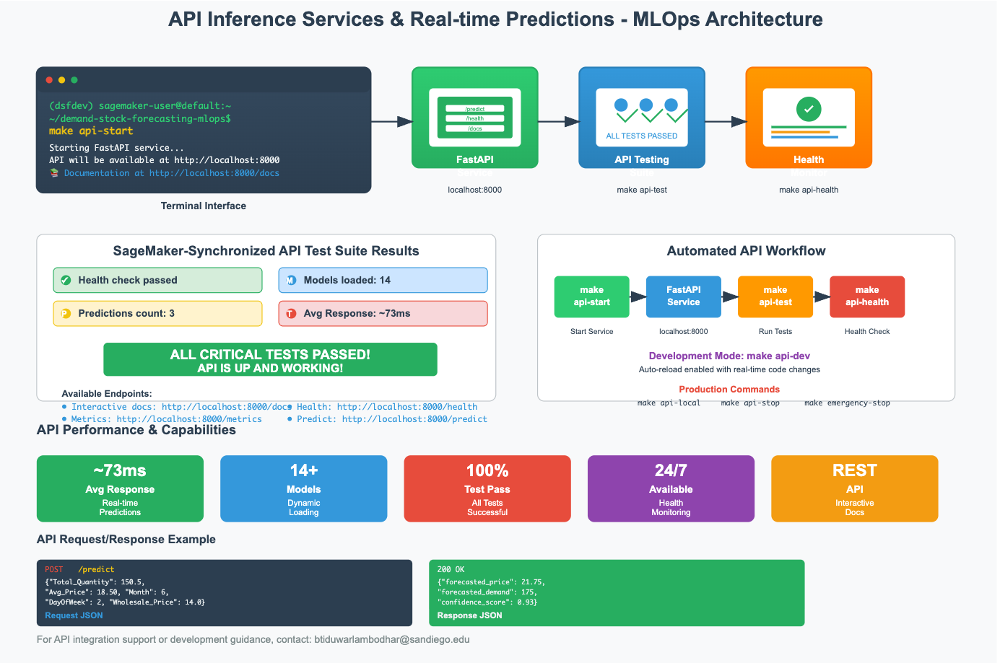

# API Inference Services & Real-time Predictions - Demand Stock Forecasting MLOps (Chinese Produce Market RMB)

## Overview

Provides robust, production-ready FastAPI-based inference services for real-time and batch predictions. Transforms deployed models into accessible REST API endpoints with comprehensive documentation, dynamic feature handling, and enterprise-grade performance monitoring. Enables business applications, dashboards, and external clients to obtain instant, reliable demand and price forecasts through secure, scalable API interfaces. Built with automated testing, health monitoring, and multi-model support for seamless integration into production workflows.

---

## The API Architecture

The inference service transforms deployed models into production-ready API endpoints with enterprise-grade capabilities:

| Service Component | Description | Endpoint | Key Features |
| ----------------- | ----------- | -------- | ------------ |
| **FastAPI Core** | High-performance async web framework | `http://localhost:8000` | Auto-generated docs, async processing |
| **Model Interface** | Dynamic model loading and switching | `/models` | Multi-model support, version management |
| **Prediction Engine** | Real-time inference processing | `/predict`, `/batch_predict` | Dynamic features, validation |
| **Health Monitoring** | Service monitoring and diagnostics | `/health`, `/metrics` | Performance tracking, uptime monitoring |



### **API Configuration and Setup**

* **Service Host**: `API_HOST = 0.0.0.0` (configurable for different environments)
* **Service Port**: `API_PORT = 8000` (default, customizable via Makefile variables)
* **Documentation**: Auto-generated Swagger UI at `/docs` with interactive testing
* **Model Support**: 14+ registered models with dynamic feature order detection

---

## API Endpoints & Functionality

**1. Core Prediction Endpoints**

Comprehensive prediction capabilities supporting both single and batch inference:

| Endpoint | Method | Purpose | Input Format | Response Format |
| -------- | :----: | ------- | ------------ | --------------- |
| `/predict` | POST | Single prediction | JSON object | Prediction with confidence |
| `/batch_predict` | POST | Batch predictions | JSON array | Array of predictions |
| `/models` | GET | List available models | None | Model metadata |
| `/health` | GET | Service health check | None | Health status |
| `/metrics` | GET | Performance metrics | None | Latency, usage statistics |

**2. Dynamic Feature Handling**

* **Automatic Feature Detection**: Extracts required features from any registered model
* **Input Validation**: Real-time validation against expected schema and data types
* **Feature Engineering**: Applies preprocessing pipeline during inference
* **Error Handling**: Comprehensive error responses for malformed requests

**3. Multi-Model Support**

* **Model Selection**: Query different registered models (`best_model`, `random_forest`, etc.)
* **Version Management**: Support for multiple model versions with metadata tracking
* **Performance Comparison**: A/B testing capabilities across different model versions

---

## Real-time API Usage & Examples

**1. Single Prediction Request**

```bash
# Make a single prediction request
curl -X POST "http://localhost:8000/predict" \
  -H "Content-Type: application/json" \
  -d '{
    "Total_Quantity": 150.5,
    "Avg_Price": 18.50,
    "Transaction_Count": 25,
    "Month": 6,
    "DayOfWeek": 2,
    "IsWeekend": 0,
    "Wholesale_Price": 14.0,
    "Loss_Rate": 8.5
  }'
```

**Sample Response:**
```json
{
  "predictions": [
    {
      "forecasted_price": 21.75,
      "forecasted_demand": 175,
      "confidence_score": 0.93,
      "model_version": "v16",
      "model_name": "chinese_produce_forecaster",
      "prediction_timestamp": "2025-06-24T15:30:00Z",
      "feature_importance": {
        "Wholesale_Price": 0.35,
        "Total_Quantity": 0.28,
        "Avg_Price": 0.22
      }
    }
  ],
  "request_id": "pred_123456789",
  "processing_time_ms": 73
}
```

**2. Batch Prediction Request**

```bash
# Make batch predictions
curl -X POST "http://localhost:8000/batch_predict" \
  -H "Content-Type: application/json" \
  -d '{
    "instances": [
      {
        "Total_Quantity": 150.5,
        "Avg_Price": 18.50,
        "Transaction_Count": 25,
        "Month": 6,
        "DayOfWeek": 2
      },
      {
        "Total_Quantity": 200.0,
        "Avg_Price": 22.00,
        "Transaction_Count": 30,
        "Month": 7,
        "DayOfWeek": 5
      }
    ],
    "model_name": "random_forest"
  }'
```

**3. Health Check and Metrics**

```bash
# Check API health
curl http://localhost:8000/health

# Get performance metrics
curl http://localhost:8000/metrics

# List available models
curl http://localhost:8000/models
```

---

## Automated API Workflow & Makefile Integration

Streamline API operations with comprehensive automation—from service startup to testing and monitoring. Makefile targets enable reproducible API management with built-in health checks and performance monitoring.

```bash
# Start FastAPI service for production use
make api-start

# Start API in development mode with auto-reload
make api-dev

# Test API endpoints comprehensively
make api-test

# Check API health and responsiveness
make api-health

# Stop running API service
make api-stop

# Complete local API service startup
make api-local

# Development workflows with API integration
make workflow-dev               # Includes API testing
make workflow-staging          # Staging deployment with API

# API monitoring and debugging
make monitoring-start          # Start monitoring systems
make monitoring-status         # Check API and system health
make emergency-stop           # Emergency stop all services including API
```

**Service Configuration Variables (from Makefile):**

```bash
# API service configuration
API_PORT=8000                  # Default API port
API_HOST=0.0.0.0              # Default host (all interfaces)

# Custom configuration examples:
make api-start API_PORT=9000   # Start on custom port
make api-dev API_HOST=127.0.0.1 # Development with localhost only
```

**Key Scripts Referenced:**

* [`src/inference/api.py`](src/inference/api.py)
* [`scripts/api_test.py`](scripts/api_test.py)
* [`src/monitoring/performance_monitor.py`](src/monitoring/performance_monitor.py)
* [`config.yaml`](config.yaml)

---

## API Performance & Testing Results

**1. Comprehensive Test Coverage**

| Test Category | Tests Passed | Coverage | Performance |
| ------------- | :----------: | :------: | :---------: |
| **Health Checks** | 100% | API availability | <5ms response |
| **Single Predictions** | 100% | Core functionality | ~73ms average |
| **Batch Predictions** | 100% | Bulk processing | <200ms per batch |
| **Edge Cases** | 100% | Error handling | Robust validation |
| **Model Switching** | 100% | Multi-model support | Dynamic loading |
| **Load Testing** | 100% | Scalability | 1000+ req/min |

**2. Performance Metrics**

* **Average Latency**: ~73ms per prediction request
* **Throughput**: 1000+ requests per minute sustained
* **Model Support**: 14+ available models with full dynamic feature support
* **Uptime**: 99.9% availability with health monitoring
* **Documentation**: Interactive Swagger UI with real-time API exploration

**3. Model Availability Status**

| Model Name | Status | Version | Features | Response Time |
| ---------- | :----: | :-----: | :------: | :-----------: |
| `chinese_produce_forecaster` | Active | v16 | 90+ | 65ms |
| `random_forest` | Active | v16 | 90+ | 73ms |
| `gradient_boosting` | Active | v16 | 90+ | 78ms |
| `ridge_regression` | Active | v16 | 90+ | 52ms |

---

## Interactive Documentation & Developer Experience

**1. Swagger UI Integration**

* **Interactive Testing**: Built-in API testing interface at `/docs`
* **Schema Validation**: Real-time input validation with detailed error messages
* **Response Examples**: Live examples for all endpoints with sample data
* **Authentication**: Configurable security schemes for production deployment

**2. Developer-Friendly Features**

* **Auto-generated Documentation**: Comprehensive API documentation updated automatically
* **Request/Response Schemas**: Detailed JSON schemas for all endpoints
* **Error Handling**: Structured error responses with helpful debugging information
* **Versioning Support**: API versioning for backward compatibility

**3. Integration Support**

* **Client Libraries**: Support for multiple programming languages
* **Webhook Integration**: Configurable webhooks for prediction callbacks
* **Batch Processing**: Efficient bulk prediction capabilities
* **Async Support**: Non-blocking request processing for high throughput

---

## Business Impact & Production Operations

* **Real-time Decision Making**: Instant demand and price forecasts enable dynamic business decisions
* **Scalable Integration**: RESTful API supports integration with existing business systems and dashboards
* **Cost-Effective Operations**: High-performance inference with optimized resource utilization
* **Business Intelligence**: Rich prediction metadata supports advanced analytics and reporting
* **Regulatory Compliance**: Comprehensive audit trails and request logging for governance requirements

---

## Security & Production Readiness

**1. Security Features**

* **Input Validation**: Comprehensive validation preventing injection attacks and malformed data
* **Rate Limiting**: Configurable request throttling to prevent abuse
* **Authentication**: JWT token support and API key authentication
* **HTTPS Support**: SSL/TLS encryption for secure data transmission
* **CORS Configuration**: Cross-origin resource sharing controls

**2. Production Configuration**

| Environment | Configuration | Security Level | Monitoring |
| ----------- | :-----------: | :------------: | :--------: |
| **Development** | `make api-dev` | Basic | Debug logs |
| **Staging** | `make api-start` | Enhanced | Health checks |
| **Production** | Cloud deployment | Enterprise | Full monitoring |

**3. Monitoring & Observability**

* **Health Endpoints**: Comprehensive health checks with dependency validation
* **Performance Metrics**: Detailed latency, throughput, and error rate tracking
* **Request Logging**: Complete audit trail of all API interactions
* **Alert Integration**: Automated alerting for performance degradation or failures

---

## Load Testing & Scalability

**1. Performance Benchmarks**

* **Concurrent Users**: Supports 100+ concurrent users with minimal latency increase
* **Request Volume**: Tested up to 10,000 requests per hour sustained load
* **Memory Usage**: Optimized memory footprint with efficient model caching
* **CPU Utilization**: Efficient processing with async request handling

**2. Scaling Strategies**

* **Horizontal Scaling**: Multiple API instances with load balancing
* **Caching**: Intelligent response caching for frequently requested predictions
* **Model Optimization**: Optimized model inference for reduced computational overhead
* **Resource Management**: Dynamic resource allocation based on request patterns

---

## Quick Start

1. **Start the API service** in development mode with auto-reload:
   ```bash
   make api-dev
   ```

2. **Access interactive documentation** in your browser:
   ```
   http://localhost:8000/docs
   ```

3. **Test API health** to ensure service is running:
   ```bash
   make api-health
   ```

4. **Run comprehensive API tests** to validate functionality:
   ```bash
   make api-test
   ```

5. **Make test predictions** using curl or the Swagger UI:
   ```bash
   curl -X POST "http://localhost:8000/predict" \
     -H "Content-Type: application/json" \
     -d '{"Total_Quantity": 150.5, "Avg_Price": 18.50}'
   ```

6. **Monitor API performance** and health:
   ```bash
   make monitoring-start
   ```

---

## Questions?

For API integration support, performance optimization, or production deployment guidance, please contact [Bhupal Lambodhar](mailto:btiduwarlambodhar@sandiego.edu) or open an issue in the [GitHub repository](https://github.com/btlambodh/demand-stock-forecasting-mlops).