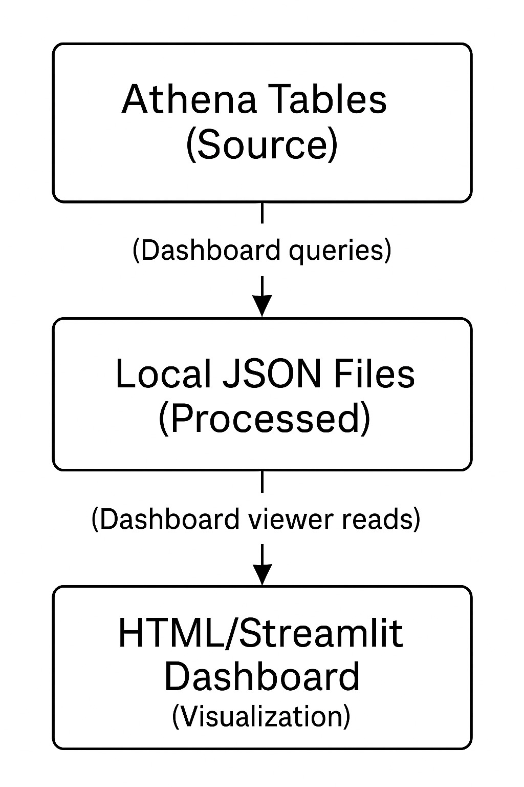

# Chinese Produce Market Analytics - BI Dashboard

## Overview

A comprehensive Business Intelligence dashboard for analyzing Chinese produce market data. This dashboard connects to your existing AWS Athena tables (created by the ML pipeline) and generates interactive visualizations, reports, and insights.

## Architecture



## Prerequisites

### AWS Infrastructure (Already Set Up)
- AWS Athena database: `demand_stock_forecasting_mlops_feature_store`
- Tables: `features_complete`, `train_data`, `validation_data`, `test_data`
- IAM permissions for Athena and S3 access
- SageMaker execution role configured

### Local Requirements
- Python 3.8+
- Valid `config.yaml` file
- Required Python packages (see Installation)

## Installation

### 1. Install Dependencies
```bash
pip install pandas numpy boto3 PyYAML streamlit plotly
```

### 2. Verify Configuration
Ensure your `config.yaml` contains:
```yaml
aws:
  region: us-east-1
  athena:
    database_name: demand_stock_forecasting_mlops_feature_store
    query_results_location: s3://your-bucket/athena-results/
    workgroup: primary
```

### 3. Verify File Structure
```
your-project/
├── config.yaml
├── src/dashboard/
│   ├── bi_dashboard_generator.py
│   └── dashboard_viewer.py
└── scripts/
    └── run_dashboard.py
```

## Quick Start

### 1. Set Up Infrastructure
```bash
python3 scripts/run_dashboard.py setup
```

**Expected Output:**
```
============================================================
SETTING UP DASHBOARD INFRASTRUCTURE
============================================================
  Created directory: dashboard_data
  Created directory: reports
  Created directory: src/dashboard
  Found: Configuration file
  Found: BI Dashboard Generator
  Found: Dashboard Viewer

SUCCESS: Dashboard infrastructure setup completed!
```

### 2. Generate Dashboard Data
```bash
python3 scripts/run_dashboard.py generate
```

**Expected Output:**
```
============================================================
GENERATING COMPLETE DASHBOARD DATA
============================================================
INFO - Executing query: overview_total_records
SUCCESS overview_total_records: Retrieved 1 records
INFO - Executing query: overview_total_revenue
SUCCESS overview_total_revenue: Retrieved 1 records
...

======================================================================
BUSINESS INTELLIGENCE DASHBOARD SUMMARY
======================================================================
Data Period: 2020-07-01 00:00:00.000 to 2023-06-30 00:00:00.000
Total Revenue: 3,372,704.66 RMB
Total Transactions: 46,595
Average Revenue: 72.38 RMB

Top Performing Categories:
   1. Category 4: 1,079,993.84 RMB (18,090 transactions)
   2. Category 2: 754,677.52 RMB (10,756 transactions)
   3. Category 3: 620,363.28 RMB (9,458 transactions)

Data Components Generated:
   SUCCESS Overview: 5 datasets
   SUCCESS Revenue Trends: 3 datasets
   SUCCESS Category Analysis: 3 datasets
   SUCCESS Price Analysis: 3 datasets
   SUCCESS Market Insights: 4 datasets
   SUCCESS Forecasting Features: 3 datasets

SUCCESS: Dashboard data generation completed successfully!
```

### 3. View Dashboard Data
```bash
python3 scripts/run_dashboard.py view
```

**Expected Output:**
```
============================================================
DASHBOARD DATA SUMMARY
============================================================

OVERVIEW METRICS:
  Data Period: 2020-07-01 00:00:00.000 to 2023-06-30 00:00:00.000
  Total Records: 46,595
  Total Revenue: 3,372,704.66 RMB
  Total Transactions: 46,595
  Average Revenue: 72.38 RMB
  Unique Categories: 4

REVENUE TRENDS:
  Available months: 36
  Recent months:
    2023-04: 74,802.44 RMB
    2023-05: 77,989.76 RMB
    2023-06: 70,083.26 RMB

TOP 5 CATEGORIES:
  1. Category 4: 1,079,994 RMB (18,090 transactions)
  2. Category 2: 754,678 RMB (10,756 transactions)
  3. Category 3: 620,363 RMB (9,458 transactions)
  4. Category 1: 917,671 RMB (7,691 transactions)

MARKET INSIGHTS:
  Weekend vs Weekday:
    Weekday: 2,707,364 RMB (37,276 transactions)
    Weekend: 665,341 RMB (9,319 transactions)

DATA COMPONENTS:
  Overview: 5 datasets
  Revenue Trends: 3 datasets
  Category Analysis: 3 datasets
  Price Analysis: 3 datasets
  Market Insights: 4 datasets
  Forecasting Features: 3 datasets

SUCCESS: Dashboard data loaded and displayed successfully!
```

## Dashboard Interfaces

### 1. HTML Dashboard
```bash
# Generate static HTML dashboard
python3 scripts/run_dashboard.py html

# Serve locally
cd dashboard_data && python3 -m http.server 8080
# Open: http://localhost:8080/dashboard.html
```

**Features:**
- Key metrics overview
- Interactive revenue trend charts
- Top categories visualization
- Mobile-responsive design

### 2. Streamlit Interactive Dashboard
```bash
python3 scripts/run_dashboard.py streamlit
```

**Features:**
- Multi-page interactive interface
- Real-time data filtering
- Downloadable reports
- Advanced visualizations

**Pages Available:**
- Overview: Key metrics and KPIs
- Revenue Trends: Time series analysis
- Category Analysis: Product category insights
- Price Analysis: Pricing trends and volatility
- Market Insights: Behavioral patterns

## Advanced Usage

### Component-Specific Generation
Generate only specific dashboard components:

```bash
# Generate only overview metrics
python3 scripts/run_dashboard.py overview

# Generate only revenue trends
python3 scripts/run_dashboard.py revenue

# Generate only category analysis
python3 scripts/run_dashboard.py categories

# Generate only market insights
python3 scripts/run_dashboard.py market
```

### Business Reports
```bash
# Generate daily business report
python3 scripts/run_dashboard.py report
```

**Expected Output:**
```
============================================================
GENERATING DAILY BUSINESS REPORT
============================================================

SUCCESS: Daily report generated: reports/daily_report_2024-06-24.txt

REPORT SUMMARY:
  DAILY BUSINESS REPORT - 2024-06-24
  ==================================================
  
  EXECUTIVE SUMMARY:
  --------------------
  Total Revenue: 3,372,704.66 RMB
  Total Transactions: 46,595
  Average Revenue per Transaction: 72.38 RMB
  Total Records Processed: 46,595
  Data Coverage: 2020-07-01 00:00:00.000 to 2023-06-30 00:00:00.000
  
  TOP PERFORMING CATEGORIES:
  ------------------------------
  1. Category 4
     Revenue: 1,079,994 RMB
     Transactions: 18,090
  
  2. Category 2
     Revenue: 754,678 RMB
     Transactions: 10,756
  ...
```

### System Status Check
```bash
python3 scripts/run_dashboard.py status
```

**Expected Output:**
```
============================================================
DASHBOARD SYSTEM STATUS
============================================================

FILE STATUS:
  Config File: EXISTS (850 bytes)
  BI Generator: EXISTS (28,634 bytes)
  Dashboard Viewer: EXISTS (18,492 bytes)
  Dashboard Data: EXISTS (15,672 bytes)
  HTML Dashboard: EXISTS (8,934 bytes)

DIRECTORY STATUS:
  dashboard_data: EXISTS (8 files)
  reports: EXISTS (1 files)
  src/dashboard: EXISTS (2 files)

PYTHON DEPENDENCIES:
  PyYAML: Available
  Boto3: Available
  Pandas: Available
  JSON (built-in): Available
  Streamlit (optional): Available

DASHBOARD DATA STATUS:
  overview: 5 datasets
  revenue_trends: 3 datasets
  category_analysis: 3 datasets
  price_analysis: 3 datasets
  market_insights: 4 datasets
  forecasting_features: 3 datasets

OVERALL STATUS:
  Dashboard system is ready!
```

## Generated Files Structure

After running the dashboard, you'll have:

```
dashboard_data/
├── dashboard_data.json          # Complete dashboard data
├── overview.json               # Overview metrics
├── revenue_trends.json         # Revenue trend data
├── category_analysis.json      # Category performance
├── price_analysis.json         # Price analytics
├── market_insights.json        # Market behavioral data
├── forecasting_features.json   # ML-relevant features
├── summary.json               # Executive summary
├── dashboard.html             # Static HTML dashboard
└── *.csv                      # Individual data exports

reports/
└── daily_report_YYYY-MM-DD.txt # Business reports
```

## Data Schema

### Overview Metrics
```json
{
  "total_records": {"total_records": 46595},
  "unique_items": {"unique_items": 4},
  "date_range": {
    "earliest_date": "2020-07-01 00:00:00.000",
    "latest_date": "2023-06-30 00:00:00.000"
  },
  "total_revenue": {
    "total_revenue": 3372704.66,
    "avg_revenue": 72.38,
    "transaction_count": 46595
  }
}
```

### Revenue Trends
```json
{
  "monthly_revenue": [
    {
      "year": 2020,
      "month": 7,
      "monthly_revenue": 85234.45,
      "avg_price": 18.45,
      "transaction_count": 1234
    }
  ],
  "seasonal_revenue": [
    {
      "Season": "Summer",
      "seasonal_revenue": 1205467.89,
      "seasonal_transactions": 15234
    }
  ]
}
```

## Troubleshooting

### Common Issues

#### 1. "Dashboard data not found"
**Problem:** No dashboard data generated
**Solution:**
```bash
python3 scripts/run_dashboard.py generate
```

#### 2. "Revenue Trends: 0 datasets"
**Problem:** Date filtering or column name issues
**Solution:** Check Athena table schema:
```sql
DESCRIBE demand_stock_forecasting_mlops_feature_store.features_complete;
```

#### 3. "Config file not found"
**Problem:** Missing configuration
**Solution:** Ensure `config.yaml` exists with proper AWS settings

#### 4. "Query timeout" or "Access denied"
**Problem:** AWS permissions or connectivity
**Solution:** 
- Check IAM permissions for Athena
- Verify SageMaker execution role
- Test Athena connectivity manually

### Debug Mode
For detailed debugging:
```bash
# Enable verbose logging
export PYTHONPATH=.
python3 -c "
import logging
logging.basicConfig(level=logging.DEBUG)
from src.dashboard.bi_dashboard_generator import BIDashboardGenerator
gen = BIDashboardGenerator('config.yaml')
gen.generate_complete_dashboard()
"
```

### Manual Athena Testing
Test your data access directly:
```sql
-- Test basic connectivity
SELECT COUNT(*) FROM demand_stock_forecasting_mlops_feature_store.features_complete;

-- Test revenue data
SELECT SUM("Revenue") as total_revenue 
FROM demand_stock_forecasting_mlops_feature_store.features_complete 
WHERE "Revenue" IS NOT NULL;

-- Test date columns
SELECT MIN("Date"), MAX("Date") 
FROM demand_stock_forecasting_mlops_feature_store.features_complete;
```

## Performance Notes

- **Data Size:** ~46,595 records processed
- **Query Time:** 30-60 seconds per component
- **Memory Usage:** ~100MB for complete dashboard
- **Network:** Queries run in AWS, minimal local bandwidth

## Integration with ML Pipeline

The dashboard reads from tables created by your ML pipeline:
- Uses the same feature names and data structure
- Compatible with SageMaker model deployment
- Provides insights for model performance monitoring

## Support

For issues:
1. Check the troubleshooting section above
2. Verify AWS connectivity and permissions
3. Test individual queries in Athena console
4. Review log outputs for specific error messages

## Command Reference

| Command | Description | Expected Time |
|---------|-------------|---------------|
| `setup` | Initialize directories | < 1 second |
| `generate` | Generate all dashboard data | 2-5 minutes |
| `view` | Display data summary | < 1 second |
| `html` | Create HTML dashboard | < 5 seconds |
| `streamlit` | Run interactive dashboard | Ongoing |
| `report` | Generate business report | < 10 seconds |
| `status` | Check system health | < 5 seconds |
| `clean` | Remove generated files | < 1 second |

## License

This dashboard is part of the Chinese Produce Market Analytics project.
