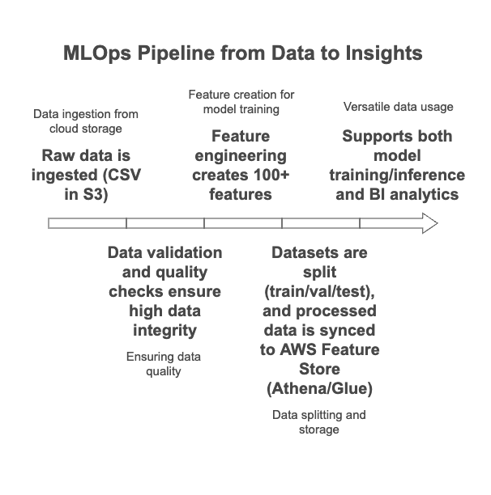

---

# Data Flow & Feature Engineering - Demand Stock Forecasting MLOps (Chinese Produce Market RMB)

## Overview

Transforms raw S3 data into a rich, validated feature set with over 100 attributes, powering robust model training and business analytics. Centralized in AWS Feature Store for scalable reuse. Leveraging historical transaction and pricing data, it automates data validation, feature engineering, AWS Feature Store and Athena integration, and prepares robust datasets for machine learning.

---

## The Dataset

Four key CSV files underpin this solution:

| File           | Description                 | Rows    | Key Fields                  |
| -------------- | --------------------------- | ------- | --------------------------- |
| **annex1.csv** | Item Master List            | \~250   | Item Code, Category Name    |
| **annex2.csv** | Sales Transactions          | 878,503 | Date, Time, Quantity, Price |
| **annex3.csv** | Historical Wholesale Prices | 55,982  | Date, Item Code, Price      |
| **annex4.csv** | Product Loss Rates          | \~250   | Item Code, Loss Rate (%)    |

### **Data Structure and Examples**

* **annex1.csv**: Maps each item to its category (e.g., vegetable, fruit), enabling group analysis.
* **annex2.csv**: Contains all daily sales, with time, item, quantity sold, unit price, discount flags, and transaction type.
* **annex3.csv**: Lists daily wholesale prices for each product, essential for margin and trend analysis.
* **annex4.csv**: Captures the percentage of each product lost in transit/storage (waste).

---

## Data Analysis & Validation

**1. File & Schema Validation**

* Checks for existence, schema correctness, column types, and completeness.
* Data quality score: **97.49/100** (excellent, business-ready quality).
* Business rules ensure no mismatched items, invalid prices, or impossible loss rates.

**2. Data Volumes & Scope**

* \~880K transaction records across several months/years.
* Each product is linked to master/category data for multi-level analysis.

**3. Exploratory Data Analysis (EDA)**

* Uncovered **seasonal sales patterns**, price fluctuations, and loss rates.
* **Outlier analysis** flagged rare, suspect prices or quantities.
* Data splits into train/validation/test for robust ML modeling.

---

## Feature Engineering

Over **100 features** are automatically engineered:

* **Time-based**: Day of week, season, holidays, trend signals.
* **Price dynamics**: Markups, volatility, price ratios, change rates.
* **Supply chain**: Effective supply (after loss), adjusted revenue.
* **Category-level**: Product share within category, price relative to group.
* **Rolling/Lag features**: Trends and volatility over 7, 14, 30-day windows.
* **Interaction features**: Captures combined effects (e.g., discount in holidays).

**Result:**

* Processed, ML-ready dataset (\~46,595 records, 105 features).
* Data is split: **Train (70%), Validation (15%), Test (15%)**.

---

## AWS Integration

* **S3**: Central repository for raw and processed data.
* **Feature Store**: Stores all engineered features, ensuring versioning and discoverability for models.
* **Athena/Glue**: Allows fast SQL analytics and BI dashboard connections on processed data.
* **Automation**: All ingestion, validation, feature engineering, and AWS setup is fully automated and logged.

---

## Business Impact

* **Accurate, explainable forecasts** for pricing, demand, and waste reduction.
* **Real-time and batch predictions** ready for dashboards and business workflows.
* **Data-driven insights** power inventory, pricing, and operational decisions.

---

## Quick Start

1. **Upload your raw data** (CSV) to S3 as described above.
2. **Run the provided scripts or pipeline** (see `run_end_to_end_pipeline.ipynb` or `Makefile`).
3. **Explore outputs** in Athena, Feature Store, or via BI dashboards.

---

## Questions?

For more details or technical help, please contact [Bhupal Lambodhar](mailto:btiduwarlambodhar@sandiego.edu) or open an issue in the [GitHub repository](https://github.com/btlambodh/demand-stock-forecasting-mlops).

---

**This guide is suitable for onboarding, project documentation, and executive presentations. Let me know if you want a more technical deep-dive or additional EDA plots/examples!**
