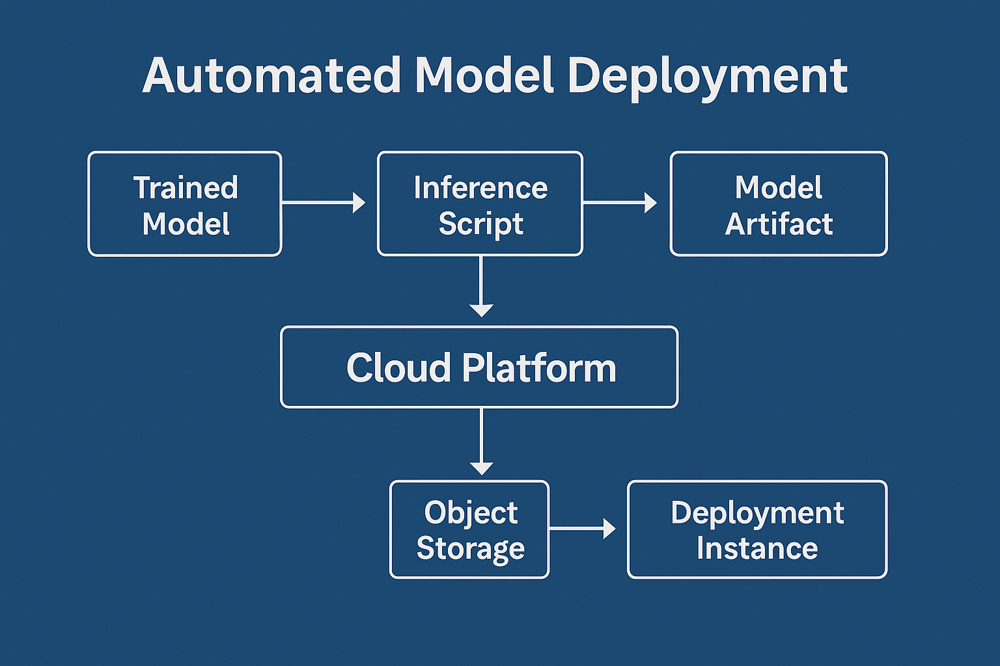

# Model Deployment

---

### Model Deployment

After selecting and registering the best-performing model, the pipeline enables **one-click deployment** to AWS SageMaker for scalable, real-time inference.

**Key Steps:**

* **Packaging for Inference:**
  The trained model and its dynamic feature order are bundled with an inference script and requirements file.
* **Upload to S3:**
  Model artifact (`model.tar.gz`) is securely uploaded to an S3 bucket for deployment.
* **SageMaker Model Creation:**
  An AWS SageMaker model is created and configured for the desired environment (e.g., dev, staging, production).
* **Endpoint Deployment:**
  The model is deployed as a real-time API endpoint (e.g., `produce-forecast-dev`), with specified compute resources.
* **Dynamic Feature Handling:**
  The deployment script auto-detects and enforces the correct feature order for robust, reliable predictions.

**Deployment Output:**

* **Live SageMaker Endpoint:**
  Example: `produce-forecast-dev`
* **Instance Type:**
  Example: `ml.m5.large`
* **Deployment Status:**
  *deployed*
* **Feature Order:**
  Extracted from the model to ensure input compatibility.

**Result:**
*Business and technical users can now access real-time, secure AI-powered price and demand forecasts via an enterprise-grade API endpoint, fully managed in AWS.*

---

