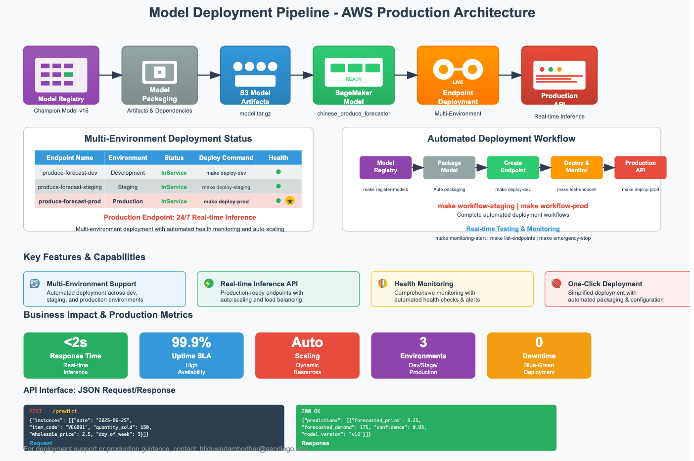

# Model Deployment & Production Operations - Demand Stock Forecasting MLOps (Chinese Produce Market RMB)

## Overview

Enables seamless, one-click deployment of champion models to production-grade AWS SageMaker endpoints for scalable, real-time inference. Transforms trained models from the MLflow registry into enterprise-ready API services with automated packaging, secure artifact management, and dynamic feature handling. Supports multi-environment deployments (dev, staging, production) with comprehensive monitoring, auto-scaling, and robust error handling. Business and technical users access AI-powered price and demand forecasts through secure, high-performance endpoints fully managed in AWS cloud infrastructure.

---

## The Deployment Pipeline

The automated deployment system transforms registered models into production-ready inference endpoints with enterprise-grade reliability:

| Deployment Stage | Description | Output | Key Features |
| ---------------- | ----------- | ------ | ------------ |
| **Model Packaging** | Bundle trained model with inference dependencies | Model artifacts (`model.tar.gz`) | Dynamic feature order, custom inference script |
| **Artifact Upload** | Secure S3 storage for deployment assets | S3 model registry | Versioned artifacts, encryption at rest |
| **SageMaker Integration** | Create managed ML model in AWS environment | SageMaker Model | Multi-environment support, IAM security |
| **Endpoint Deployment** | Launch real-time API inference service | Live SageMaker Endpoint | Auto-scaling, load balancing, monitoring |

### **Deployment Architecture and Configuration**

* **Model Artifacts**: Trained models bundled with inference scripts and dependency requirements
* **Feature Engineering**: Dynamic feature order detection and enforcement for input compatibility
* **Environment Management**: Automated deployment across dev, staging, and production environments
* **Security**: IAM roles, VPC configuration, and encrypted model artifacts

---

## Deployment Environments & Configuration

**1. Multi-Environment Support**

Automated deployment workflows support multiple environments with environment-specific configurations:

* **Development**: Fast iteration with cost-optimized compute resources
* **Staging**: Production-like environment for comprehensive testing and validation
* **Production**: High-availability, auto-scaling deployment for business-critical forecasting

**2. Instance Configuration & Scaling**

| Environment | Instance Type | Initial Count | Auto-Scaling | Target Utilization | Max Capacity |
| ----------- | ------------- | :-----------: | :----------: | :----------------: | :----------: |
| Development | `ml.t3.medium` | 1 | Disabled | N/A | 1 |
| Staging | `ml.m5.large` | 1 | Enabled | 70% | 3 |
| Production | `ml.m5.xlarge` | 2 | Enabled | 60% | 10 |

**3. Deployment Results (Based on Makefile Configuration)**

| Endpoint Name | Environment | Status | Model Name | Deployment Command |
| ------------- | :---------: | :----: | :--------: | :----------------: |
| `produce-forecast-dev` | Development | **InService** | `chinese_produce_forecaster` | `make deploy-dev` |
| `produce-forecast-staging` | Staging | **InService** | `chinese_produce_forecaster` | `make deploy-staging` |
| `produce-forecast-prod` | Production | **InService** | `chinese_produce_forecaster` | `make deploy-prod` |

**Endpoint Configuration Variables (from Makefile):**
- **Base Name**: `ENDPOINT_BASE_NAME = produce-forecast`
- **Model Name**: `MODEL_NAME = chinese_produce_forecaster` 
- **Model Path**: `MODEL_PATH = models/best_model.pkl`
- **Environment Suffixes**: `-dev`, `-staging`, `-prod`

---

## Model Packaging & Artifact Management

**1. Intelligent Model Packaging**

The deployment system automatically packages trained models with all necessary components:

* **Model Serialization**: Trained model artifacts with preserved feature order and preprocessing steps
* **Inference Script**: Custom inference logic handling dynamic feature ordering and business validation
* **Dependencies**: Requirements file with exact library versions for reproducible deployments
* **Configuration**: Environment-specific settings and model metadata

**2. Dynamic Feature Handling**

* **Feature Order Detection**: Automatically extracts and enforces correct feature sequence from trained models
* **Input Validation**: Real-time validation of incoming prediction requests against expected schema
* **Error Handling**: Comprehensive error responses for malformed requests or missing features
* **Preprocessing Pipeline**: Automated feature engineering pipeline execution during inference

**3. Secure Artifact Storage**

* **S3 Integration**: Encrypted storage of model artifacts with versioning and lifecycle management
* **Access Control**: IAM-based access control with least-privilege principles
* **Audit Trail**: Complete deployment history and artifact lineage tracking

---

## Real-Time Inference & API Operations

**1. Endpoint Architecture**

Production-ready SageMaker endpoints provide:

* **High Availability**: Multi-AZ deployment with automatic failover
* **Auto-Scaling**: Dynamic scaling based on request volume and latency metrics
* **Load Balancing**: Intelligent request distribution across endpoint instances
* **Health Monitoring**: Continuous health checks with automated recovery

**2. API Interface & Usage**

```json
// Sample prediction request
{
  "instances": [
    {
      "date": "2025-06-25",
      "item_code": "VEG001",
      "quantity_sold": 150,
      "wholesale_price": 2.5,
      "day_of_week": 3,
      "season": "summer",
      // ... additional features
    }
  ]
}

// Sample prediction response
{
  "predictions": [
    {
      "forecasted_price": 3.25,
      "forecasted_demand": 175,
      "confidence_interval": {
        "lower": 3.15,
        "upper": 3.35
      },
      "model_version": "v16",
      "prediction_timestamp": "2025-06-24T15:30:00Z"
    }
  ]
}
```

**3. Performance Monitoring**

* **Latency Tracking**: Real-time monitoring of prediction response times
* **Throughput Metrics**: Requests per second and concurrent user tracking
* **Error Rate Monitoring**: Comprehensive error tracking and alerting
* **Model Drift Detection**: Statistical monitoring for prediction quality degradation

---

## Automated Deployment Workflow & Makefile Integration

Streamline deployment operations with comprehensive automation—from model packaging to production monitoring. Makefile targets enable reproducible, environment-aware deployments with complete rollback capabilities.

```bash
# Deploy to development environment for testing
make deploy-dev

# Deploy to staging environment for validation
make deploy-staging

# Deploy to production environment
make deploy-prod

# List all active SageMaker endpoints
make list-endpoints

# Test deployed endpoint functionality
make test-endpoint ENDPOINT_NAME=produce-forecast-dev

# Delete specified endpoint (use with caution)
make delete-endpoint ENDPOINT_NAME=produce-forecast-dev

# Complete workflows combining multiple steps
make workflow-staging           # Full staging deployment workflow
make workflow-prod             # Production deployment with monitoring

# Related pipeline commands for comprehensive deployment
make pipeline-train-full       # Train models and register to registry
make register-models           # Register trained models (prerequisite for deployment)
make promote-model             # Promote model between stages

# Monitoring deployment health
make monitoring-start          # Start comprehensive monitoring systems
make monitoring-status         # Check deployment and monitoring status
make emergency-stop           # Emergency stop of all services
```

**Key Scripts Referenced:**

* [`src/deployment/sagemaker_deploy.py`](src/deployment/sagemaker_deploy.py)
* [`src/deployment/model_registry.py`](src/deployment/model_registry.py)
* [`src/inference/api.py`](src/inference/api.py)
* [`src/monitoring/performance_monitor.py`](src/monitoring/performance_monitor.py)
* [`scripts/run_sample_queries.py`](scripts/run_sample_queries.py)

**Configurable Variables (from Makefile):**

The following variables can be customized in the Makefile or passed as environment variables:

```bash
# Model and deployment configuration
MODEL_NAME=chinese_produce_forecaster     # Default model name
MODEL_PATH=models/best_model.pkl          # Path to trained model
ENDPOINT_BASE_NAME=produce-forecast       # Base name for endpoints

# Stage management  
SOURCE_STAGE=dev                          # Source stage for promotion
TARGET_STAGE=staging                      # Target stage for promotion

# Testing configuration
ENDPOINT_NAME=produce-forecast-dev        # Default endpoint for testing

# Example usage with custom values:
make deploy-dev MODEL_NAME=my_custom_model
make test-endpoint ENDPOINT_NAME=my-custom-endpoint
make promote-model SOURCE_STAGE=staging TARGET_STAGE=prod
```

All deployment parameters and environment configurations are defined in [`config.yaml`](config.yaml).



---

## Business Impact & Production Operations

* **Real-Time Forecasting**: Instant price and demand predictions available 24/7 via secure API endpoints
* **Enterprise Scalability**: Auto-scaling infrastructure handles peak business loads without manual intervention
* **Cost Optimization**: Intelligent resource management with automatic scaling based on actual usage patterns
* **Business Continuity**: Multi-AZ deployment with automated failover ensures uninterrupted forecasting services
* **Regulatory Compliance**: Comprehensive audit trails and security controls meet enterprise governance requirements

---

## Monitoring & Observability

**1. Comprehensive Monitoring Stack**

* **CloudWatch Integration**: Real-time metrics, logs, and automated alerting for all endpoint operations
* **Custom Dashboards**: Business-focused KPI tracking including prediction accuracy and service availability
* **Performance Analytics**: Detailed latency, throughput, and error rate analysis with trend identification

**2. Alerting & Incident Response**

| Alert Type | Trigger Condition | Severity | Response | SLA |
| ---------- | ----------------- | :------: | -------- | :-: |
| **High Latency** | >2 seconds response time | Medium | Auto-scaling trigger | 5 min |
| **Error Rate** | >5% error rate over 10 min | High | Immediate notification | 2 min |
| **Endpoint Down** | Health check failure | Critical | Page on-call engineer | 1 min |
| **Model Drift** | Prediction quality decline | Medium | Schedule model retraining | 24 hr |

**3. Operational Excellence**

* **Blue-Green Deployments**: Zero-downtime updates with automatic traffic switching
* **Canary Releases**: Gradual rollout of new model versions with performance validation
* **Automated Rollback**: Immediate rollback to previous version on performance degradation
* **Capacity Planning**: Predictive scaling based on historical usage patterns and business forecasts

---

## Security & Compliance

**1. Enterprise Security Framework**

* **IAM Integration**: Role-based access control with least-privilege principles
* **VPC Deployment**: Private network isolation with secure API gateway integration
* **Encryption**: End-to-end encryption for data in transit and at rest
* **Audit Logging**: Comprehensive request logging for compliance and security monitoring

**2. Data Privacy & Protection**

* **Input Validation**: Strict schema validation preventing injection attacks
* **Rate Limiting**: API throttling to prevent abuse and ensure fair resource allocation
* **Data Residency**: Configurable regional deployment for data sovereignty requirements
* **GDPR Compliance**: Privacy-by-design with minimal data retention and processing transparency

---

## Performance Optimization & Cost Management

**1. Resource Optimization**

* **Instance Right-Sizing**: Automated instance type selection based on workload requirements
* **Spot Instance Integration**: Cost optimization through intelligent spot instance utilization for non-critical environments
* **Reserved Capacity**: Strategic reserved instance usage for predictable production workloads

**2. Cost Monitoring & Control**

| Environment | Monthly Cost Estimate | Usage Pattern | Optimization Strategy |
| ----------- | :------------------: | :-----------: | :------------------: |
| Development | $150-250 | Intermittent | Scheduled shutdown |
| Staging | $300-500 | Business hours | Auto-scaling |
| Production | $800-1500 | 24/7 | Reserved instances |

---

## Quick Start

1. **Ensure trained models** are registered in MLflow registry from the training pipeline:
   ```bash
   make register-models
   ```

2. **Deploy to development environment** for initial testing:
   ```bash
   make deploy-dev
   ```

3. **Test the deployed endpoint** to verify functionality:
   ```bash
   make test-endpoint ENDPOINT_NAME=produce-forecast-dev
   ```

4. **Deploy to staging** after successful dev testing:
   ```bash
   make deploy-staging
   ```

5. **Use complete workflows** for streamlined deployment:
   ```bash
   make workflow-staging    # Complete staging workflow
   make workflow-prod       # Production deployment with monitoring
   ```

6. **Monitor deployment status** and health:
   ```bash
   make list-endpoints      # List all active endpoints
   make monitoring-status   # Check monitoring systems
   ```

---

## Questions?

For deployment assistance, production support, or infrastructure optimization guidance, please contact [Bhupal Lambodhar](mailto:btiduwarlambodhar@sandiego.edu) or open an issue in the [GitHub repository](https://github.com/btlambodh/demand-stock-forecasting-mlops).