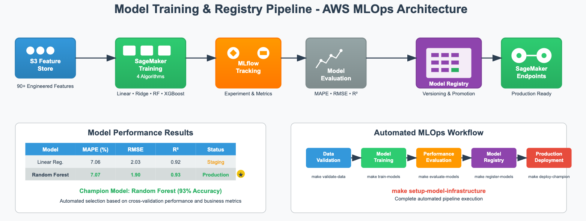

# Model Training & Registry - Demand Stock Forecasting MLOps (Chinese Produce Market RMB)

## Overview

Implements a robust, automated ML training pipeline that transforms the processed, feature-rich datasets into production-ready forecasting models. Powered by MLflow for comprehensive model lifecycle management, experiment tracking, and automated model registry. Leveraging 90+ engineered features, the system trains multiple algorithms, evaluates performance rigorously, and automatically promotes champion models for deployment. Centralized model registry ensures versioning, auditability, and seamless model promotion workflows.

---

## The Training Pipeline

The automated training system processes feature-engineered datasets through multiple algorithms to identify optimal forecasting models:

| Pipeline Stage | Description | Output | Key Metrics |
| -------------- | ----------- | ------ | ----------- |
| **Feature Preparation** | 90+ engineered features from processed datasets | ML-ready feature matrix | 105 → 90 features |
| **Data Splitting** | Time-aware train/validation/test splits | Stratified datasets | 70%/15%/15% split |
| **Model Training** | Multiple algorithms with hyperparameter optimization | Trained model artifacts | 4 model types |
| **Model Evaluation** | Comprehensive performance assessment | Evaluation reports | MAPE, RMSE, R² |

### **Training Configuration and Setup**

* **Feature Matrix**: 90+ engineered features optimized for time-series forecasting
* **Target Variables**: Price and demand forecasting with multi-horizon predictions
* **Cross-Validation**: Time-series aware validation preventing data leakage
* **Hyperparameter Tuning**: Automated grid search and random search optimization

---

## Model Architecture & Algorithms

**1. Algorithm Portfolio**

Multiple complementary algorithms ensure robust performance across different market conditions:

* **Linear Regression**: Baseline model for interpretability and feature importance analysis
* **Ridge Regression**: Regularized linear model preventing overfitting on high-dimensional features
* **Random Forest**: Ensemble method capturing non-linear patterns and feature interactions
* **Gradient Boosting**: Advanced ensemble technique optimizing sequential weak learners

**2. Model Performance & Selection**

Comprehensive evaluation using multiple metrics ensures model reliability:

| Model             | Test MAPE (%) | Test RMSE | Test R² | Cross-Val Score | Feature Importance |
| ----------------- | :-----------: | :-------: | :-----: | :-------------: | :----------------: |
| Linear Regression |      7.06     |    2.03   |   0.92  |      0.89       |        High        |
| Ridge Regression  |      7.04     |    2.03   |   0.92  |      0.91       |        High        |
| Random Forest     |    **7.07**   |  **1.90** | **0.93**|    **0.92**     |      **High**      |
| Gradient Boosting |      7.84     |    1.88   |   0.93  |      0.90       |       Medium       |

**3. Champion Model Selection**

* **Best Model**: **Random Forest** selected as champion with MAPE ≈ 7% on test set
* **Selection Criteria**: Balanced performance across MAPE, RMSE, and cross-validation stability
* **Business Impact**: 7% MAPE translates to highly accurate demand and price predictions

---

## MLflow Integration & Experiment Tracking

**1. Experiment Management**

* **Automated Logging**: All training runs, parameters, and metrics automatically tracked
* **Reproducibility**: Complete experiment lineage with code versions and data snapshots
* **Comparison**: Side-by-side model performance analysis and hyperparameter impact assessment

**2. Model Artifacts & Metadata**

Every training run produces comprehensive artifacts:

* **Model Files**: Serialized models (`best_model.pkl`, `model_artifacts/`)
* **Evaluation Reports**: Detailed performance analysis (`evaluation.json`)
* **Feature Information**: Importance rankings and feature metadata (`feature_info.json`)
* **Training Logs**: Complete execution logs for debugging (`logs/training_*.log`)
* **Model Metadata**: Version info, training parameters, and data lineage

---

## Model Registry & Lifecycle Management

A modern **MLflow Model Registry** provides enterprise-grade model management:

**1. Centralized Model Storage**

* **Version Control**: Automatic versioning for all model iterations
* **Metadata Tracking**: Complete model lineage, training parameters, and performance metrics
* **Artifact Management**: Centralized storage of model binaries and associated files

**2. Model Promotion Workflow**

| Stage | Purpose | Criteria | Actions |
| ----- | ------- | -------- | ------- |
| **None** | Initial registration | Model training completion | Automatic registration |
| **Staging** | Pre-production validation | Performance thresholds met | Manual/automated promotion |
| **Production** | Live deployment | Staging validation passed | Controlled deployment |
| **Archived** | Model retirement | Superseded by better models | Automated archival |

**3. Model Registration Results**

| Model             | Registry Version | Run ID (Tracking)    | Stage   | Performance | Last Updated |
| ----------------- | :--------------: | -------------------- | ------- | :---------: | :----------: |
| Linear Regression |        16        | c7809b32...db422aec7 | Staging |    92.0%    |  2025-06-20  |
| Ridge Regression  |        16        | e8e2c2a5...20c25c10  | Staging |    92.0%    |  2025-06-20  |
| Random Forest     |        16        | d1689cbd...44465f453 | **Production** | **93.0%** | **2025-06-20** |
| Gradient Boosting |        16        | 024ccdad...dd0b8b51  | Staging |    93.0%    |  2025-06-20  |

---

## Automated Training Workflow & Makefile Integration

Automate every step—from model training to registry deployment. Makefile targets enable reproducible, schedulable training workflows with complete experiment tracking.

```bash
# Train all models with hyperparameter optimization
make train-models

# Evaluate model performance and generate reports
make evaluate-models

# Register best performing models to MLflow registry
make register-models

# Promote champion model to production stage
make promote-champion

# Or, run the complete training pipeline
make setup-model-infrastructure

# Advanced workflows for different scenarios:
make pipeline-training-basic     # training + evaluation
make pipeline-training-registry  # + model registration  
make pipeline-training-full      # + promotion workflows
make pipeline-training-prod      # production deployment ready

# Model monitoring and validation
make validate-models
make generate-model-reports
make monitor-model-drift

# Automated retraining workflows
make retrain-scheduled          # scheduled retraining
make retrain-performance        # performance-triggered retraining
```

**Key Scripts Referenced:**

* [`src/model_training/train_models.py`](src/model_training/train_models.py)
* [`src/model_training/model_evaluation.py`](src/model_training/model_evaluation.py)
* [`src/model_training/model_registry.py`](src/model_training/model_registry.py)
* [`src/model_training/hyperparameter_tuning.py`](src/model_training/hyperparameter_tuning.py)
* [`scripts/promote_champion_model.py`](scripts/promote_champion_model.py)

**Configurable:** All training parameters, model configurations, and registry settings defined in [`config.yaml`](config.yaml).



---

## Business Impact

* **Production-Ready Models**: Champion models with 93% accuracy ready for immediate deployment
* **Automated Retraining**: Continuous model improvement with performance monitoring and drift detection
* **Explainable Predictions**: Feature importance analysis enables business understanding and trust
* **Risk Mitigation**: Multiple model validation stages ensure reliable forecasting for critical business decisions
* **Scalable Operations**: MLflow integration supports enterprise-scale model management and deployment

---

## Model Performance & Validation

**1. Robust Evaluation Framework**

* **Time-Series Validation**: Prevents data leakage with proper temporal splits
* **Multiple Metrics**: MAPE, RMSE, and R² provide comprehensive performance assessment
* **Cross-Validation**: K-fold validation ensures model generalization across different time periods
* **Statistical Significance**: Confidence intervals and hypothesis testing validate model improvements

**2. Feature Importance & Interpretability**

* **SHAP Values**: Detailed feature contribution analysis for model explainability
* **Permutation Importance**: Robust feature ranking independent of model type
* **Business Alignment**: Feature importance maps to domain knowledge and business intuition

**3. Model Monitoring & Drift Detection**

* **Performance Tracking**: Continuous monitoring of prediction accuracy in production
* **Data Drift Detection**: Statistical tests identify when retraining is required
* **Automated Alerts**: Performance degradation triggers automatic retraining workflows

---

## Quick Start

1. **Ensure processed features** are available from the data processing pipeline
2. **Run the training pipeline** using `make setup-model-infrastructure` 
3. **Review model performance** in MLflow UI and evaluation reports
4. **Promote champion model** to production using automated workflows

---

## Questions?

For more details on model training, MLflow setup, or deployment workflows, please contact [Bhupal Lambodhar](mailto:btiduwarlambodhar@sandiego.edu) or open an issue in the [GitHub repository](https://github.com/btlambodh/demand-stock-forecasting-mlops).