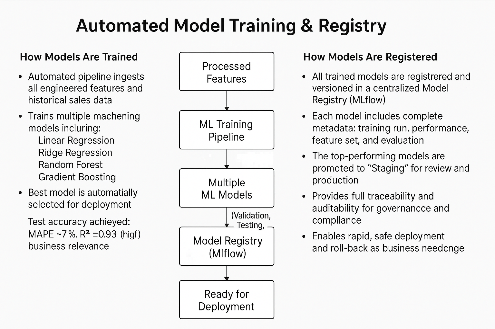

# Model Training & Model Registry

---

### Model Training

The project implements a robust, automated ML training pipeline using the processed, feature-rich datasets. Key steps:

* **Feature Preparation:**
  90+ engineered features (from 105 original) are used for supervised learning to forecast price and demand.
* **Train/Validation/Test Splits:**
  Models are trained on historical data, validated on a holdout set, and rigorously tested for generalization.
* **Model Types:**
  Multiple algorithms are trained and evaluated:

  * **Linear Regression**
  * **Ridge Regression**
  * **Random Forest**
  * **Gradient Boosting**
* **Performance Metrics:**
  Models are evaluated using:

  * **MAPE** (Mean Absolute Percentage Error)
  * **RMSE** (Root Mean Squared Error)
  * **R²** (Coefficient of Determination)

#### Example Results

| Model             | Test MAPE (%) | Test RMSE | Test R² |
| ----------------- | :-----------: | :-------: | :-----: |
| Linear Regression |      7.06     |    2.03   |   0.92  |
| Ridge Regression  |      7.04     |    2.03   |   0.92  |
| Random Forest     |      7.07     |    1.90   |   0.93  |
| Gradient Boosting |      7.84     |    1.88   |   0.93  |

* **Best Model (Sample Run):**
  *Random Forest* selected as the champion model with **MAPE ≈ 7%** on the test set.

#### Training Pipeline Outputs

* Trained models (serialized files, e.g., `best_model.pkl`)
* Evaluation reports (`evaluation.json`)
* Feature importance and info (`feature_info.json`)
* Full logs for traceability (`logs/`)

---

### Model Registry

A modern **model registry** (powered by MLflow) is used for:

* **Centralized Model Storage:**
  All trained models and their versions are registered with full metadata.
* **Automated Versioning:**
  New models are automatically versioned; the registry tracks each experiment and result.
* **Promotion and Staging:**
  High-performing models are promoted to *Staging* for further review or deployment.
* **Auditability:**
  Run IDs and full lineage are tracked for every registered model.

#### Model Registration Results (Sample Run)

| Model             | Registry Version | Run ID (Tracking)    | Stage   |
| ----------------- | :--------------: | -------------------- | ------- |
| Linear Regression |        16        | c7809b32...db422aec7 | Staging |
| Ridge Regression  |        16        | e8e2c2a5...20c25c10  | Staging |
| Random Forest     |        16        | d1689cbd...44465f453 | Staging |
| Gradient Boosting |        16        | 024ccdad...dd0b8b51  | Staging |

